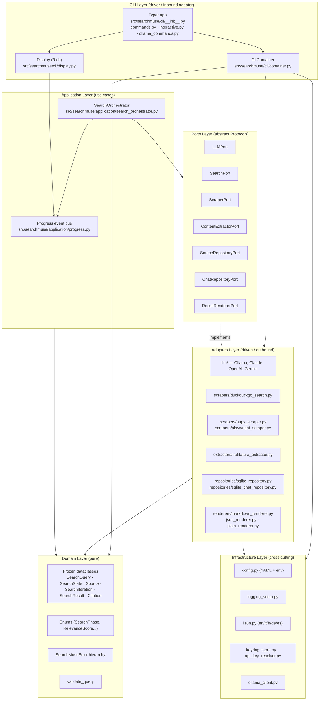

<!-- refreshed: 2026-05-18 -->
# Architecture

**Analysis Date:** 2026-05-18

## System Overview

SearchMuse is a Python 3.11+ CLI application implemented in strict **hexagonal (ports-and-adapters)** architecture. The domain core is fully framework-agnostic and side-effect free; every interaction with the outside world (LLM providers, search engines, the web, SQLite, the terminal) goes through a `typing.Protocol` defined in `src/searchmuse/ports/`. A single `SearchOrchestrator` application service drives the iterative research loop by depending only on ports, never on concrete adapters.

## Component Responsibilities

| Component | Responsibility | File |
|-----------|----------------|------|
| Typer app | CLI entry point, command parsing, subcommand registration | `src/searchmuse/cli/__init__.py` |
| `run_search` / config subcommands | Map CLI args to env vars, build container, run async orchestrator, format errors | `src/searchmuse/cli/commands.py` |
| `InteractiveSession` | Chat-style REPL with persisted history | `src/searchmuse/cli/interactive.py` |
| `Container` / `build_container` | Composition root; wires concrete adapters to ports | `src/searchmuse/cli/container.py` |
| `Display` | Rich-based terminal UI; consumes `ProgressEvent`s | `src/searchmuse/cli/display.py` |
| `SearchOrchestrator` | Drives the iterative search loop (strategy → search → scrape → extract → assess → synthesize) | `src/searchmuse/application/search_orchestrator.py` |
| `ProgressEvent` / `NullProgress` | Decoupled progress bus between application and UI | `src/searchmuse/application/progress.py` |
| Domain models | Frozen `@dataclass(slots=True)` value objects; immutable state transitions | `src/searchmuse/domain/models.py` |
| Domain enums | `SearchPhase`, `RelevanceScore`, `ContentType`, `SourceStatus` | `src/searchmuse/domain/enums.py` |
| Error hierarchy | `SearchMuseError` root + typed subclasses | `src/searchmuse/domain/errors.py` |
| `validate_query` | Input validation at the domain boundary | `src/searchmuse/domain/validators.py` |
| Config loader | YAML + `SEARCHMUSE_*` env overlay producing frozen `SearchMuseConfig` | `src/searchmuse/infrastructure/config.py` |
| API key resolver | Env → keyring → config chain | `src/searchmuse/infrastructure/api_key_resolver.py` |
| Logging setup | Structured logger configuration | `src/searchmuse/infrastructure/logging_setup.py` |
| i18n | Translation lookup `t(key, **vars)` for UI strings | `src/searchmuse/infrastructure/i18n.py` |
| Keyring store | Optional secret persistence via `keyring` | `src/searchmuse/infrastructure/keyring_store.py` |
| Ollama HTTP client | Low-level Ollama REST helper | `src/searchmuse/infrastructure/ollama_client.py` |

## Pattern Overview

**Overall:** Hexagonal (Ports & Adapters) with a thin CLI driver, a single application service, and constructor-injected adapters.

**Key Characteristics:**
- Pure, async-first domain and application layers — no I/O outside adapters.
- All domain models are frozen dataclasses with slots; state evolution uses `dataclasses.replace` via `with_*` helpers (see `SearchState.with_new_iteration`, `with_phase`, `with_sources` in `src/searchmuse/domain/models.py`).
- Ports are `typing.Protocol`s marked `@runtime_checkable`; adapters are duck-typed and never inherit from the protocol.
- Composition happens exactly once, in `Container.__init__` (`src/searchmuse/cli/container.py`).
- Configuration is loaded once, frozen, and threaded into adapters and the orchestrator.

## Layers

**Domain (`src/searchmuse/domain/`)**
- Purpose: Pure business types and rules.
- Contains: `models.py` (frozen dataclasses), `enums.py` (StrEnums), `errors.py` (exception hierarchy), `validators.py` (input validation).
- Depends on: Standard library only.
- Used by: Every other layer.

**Ports (`src/searchmuse/ports/`)**
- Purpose: Abstract contracts the application requires from the outside world.
- Contains: One `Protocol` per outbound capability.
- Depends on: `domain/` (only via `TYPE_CHECKING` to avoid runtime imports).
- Used by: Application, Adapters (implicitly), Container.

**Application (`src/searchmuse/application/`)**
- Purpose: Use case orchestration.
- Contains: `SearchOrchestrator` and the progress event protocol.
- Depends on: `domain/`, `ports/`, `infrastructure/i18n` for translated progress messages.
- Used by: CLI Container.

**Adapters (`src/searchmuse/adapters/`)**
- Purpose: Concrete implementations of ports against external systems.
- Contains: Subpackages `llm/`, `scrapers/`, `extractors/`, `renderers/`, `repositories/`.
- Depends on: `ports/`, `domain/`, `infrastructure/`.
- Used by: `Container` only.

**Infrastructure (`src/searchmuse/infrastructure/`)**
- Purpose: Cross-cutting technical services (config, logging, i18n, secret resolution, low-level HTTP client).
- Depends on: Standard library, `pyyaml`, `httpx`, optional `keyring`.
- Used by: CLI, adapters, application (i18n only).

**CLI (`src/searchmuse/cli/`)**
- Purpose: Driver / inbound adapter — Typer-based command surface.
- Contains: command definitions, the DI container, Rich display, interactive REPL, ollama management commands.
- Depends on: every other layer.
- Used by: end users via the `searchmuse` script.

## Data Flow

### Primary Request Path — `searchmuse search "query"`

1. Typer dispatches to `search_command` (`src/searchmuse/cli/__init__.py:57`) which calls `run_search` (`src/searchmuse/cli/commands.py:32`).
2. `run_search` maps CLI flags into `SEARCHMUSE_*` env vars, builds the `Display`, and calls `build_container` (`src/searchmuse/cli/container.py:109`).
3. `build_container` loads config (`infrastructure/config.py: load_config`), sets up logging + language, and instantiates `Container`, wiring every adapter to its port.
4. `Container.__init__` constructs: `create_llm_adapter(config.llm)` (`adapters/llm/_factory.py:19`), `DuckDuckGoSearchAdapter`, `HttpxScraperAdapter` or `PlaywrightScraperAdapter` (selected by `config.scraping.use_playwright`), `TrafilaturaExtractorAdapter`, `SqliteRepositoryAdapter`, `SqliteChatRepositoryAdapter`, `create_renderer(...)`, then injects them all into `SearchOrchestrator`.
5. `asyncio.run(_async_search(container, query))` (`cli/commands.py:76`) calls `container.orchestrator.run(query)`.
6. `SearchOrchestrator.run` (`application/search_orchestrator.py:92`):
   - normalizes the query via `validate_query` and builds a frozen `SearchQuery`;
   - creates the initial `SearchState` and loops up to `config.search.max_iterations`;
   - per iteration (`_run_iteration`, line 163): asks `LLMPort.generate_search_strategy`, fans out `SearchPort.search` per term, deduplicates URLs against `state.all_sources`, calls `ScraperPort.scrape_many`, runs `ContentExtractorPort.extract` per page, asks `LLMPort.assess_content_relevance` per content, persists relevant ones via `SourceRepositoryPort.save`, then asks `LLMPort.assess_coverage`;
   - terminates early when coverage and source counts cross the configured thresholds.
7. `_synthesize` (line 296) calls `LLMPort.synthesize_answer` and builds the immutable `SearchResult` with numbered `Citation`s.
8. `run_search` calls `container.renderer.render(result)` and prints via `Display.show_result` / `show_result_raw`.
9. `finally` block calls `container.close()` releasing scraper sessions, search client and SQLite handles.

### Progress Event Flow

1. `Display.make_progress_callback()` returns a `ProgressCallback`.
2. `SearchOrchestrator._emit` (`application/search_orchestrator.py:77`) constructs frozen `ProgressEvent`s tagged with the current `SearchPhase`.
3. The callback feeds the Rich live UI; the orchestrator has no knowledge of Rich.

### Interactive / Chat Flow

1. `searchmuse` with no subcommand instantiates `InteractiveSession` (`src/searchmuse/cli/interactive.py`).
2. Chat history is persisted via `SqliteChatRepositoryAdapter` (port `ChatRepositoryPort`).
3. Each user turn invokes `SearchOrchestrator.run(raw_query, chat_context=...)`, passing prior `(query, synthesis)` pairs that `LLMPort.generate_search_strategy` uses for continuity.

**State Management:**
- All state is immutable. `SearchState` exposes `with_phase`, `with_new_iteration`, `with_sources` returning fresh instances.
- No module-level mutable globals; configuration is captured once in the container.

## Key Abstractions (Ports)

Defined in `src/searchmuse/ports/` and re-exported by `src/searchmuse/ports/__init__.py`.

| Port | File | Methods |
|------|------|---------|
| `LLMPort` | `src/searchmuse/ports/llm_port.py` | `generate_search_strategy`, `assess_content_relevance`, `assess_coverage`, `synthesize_answer` |
| `SearchPort` | `src/searchmuse/ports/search_port.py` | `search`, `close` |
| `ScraperPort` | `src/searchmuse/ports/scraper_port.py` | `scrape`, `scrape_many`, `can_handle`, `close` |
| `ContentExtractorPort` | `src/searchmuse/ports/content_extractor_port.py` | `extract`, `supports_content_type` |
| `ResultRendererPort` | `src/searchmuse/ports/result_renderer_port.py` | `render`, `format_name` |
| `SourceRepositoryPort` | `src/searchmuse/ports/source_repository_port.py` | `save`, `find_by_id`, `find_by_session`, `find_by_url` |
| `ChatRepositoryPort` | `src/searchmuse/ports/chat_repository_port.py` | `create_session`, `save_message`, `update_session_name`, `update_session_timestamp`, `load_session`, `list_sessions`, `delete_session`, `find_session_by_name`, `close` |

All protocols are decorated `@runtime_checkable` and use `from __future__ import annotations` with `TYPE_CHECKING`-guarded domain imports.

## Concrete Adapters

Located under `src/searchmuse/adapters/`.

**LLM (`adapters/llm/`):**
- `ollama_adapter.py` — `OllamaLLMAdapter` (default, local).
- `claude_adapter.py` — `ClaudeLLMAdapter` (Anthropic SDK, optional extra `[claude]`).
- `openai_adapter.py` — `OpenAILLMAdapter` (optional extra `[openai]`).
- `gemini_adapter.py` — `GeminiLLMAdapter` (Google GenAI SDK, optional extra `[gemini]`).
- Shared internals: `_base.py` (`BaseLLMAdapter`), `_defaults.py` (`PROVIDER_DEFAULTS`, `SUPPORTED_PROVIDERS`), `_helpers.py`, `prompts.py`, `_factory.py` (`create_llm_adapter`).

**Search (`adapters/scrapers/`):**
- `duckduckgo_search.py` — `DuckDuckGoSearchAdapter` implementing `SearchPort` via `duckduckgo-search`.

**Scrapers (`adapters/scrapers/`):**
- `httpx_scraper.py` — `HttpxScraperAdapter` (default, static HTML over `httpx[http2]`).
- `playwright_scraper.py` — `PlaywrightScraperAdapter` (JS-rendered SPAs, opt-in via `config.scraping.use_playwright`).

**Extractors (`adapters/extractors/`):**
- `trafilatura_extractor.py` — `TrafilaturaExtractorAdapter` wrapping `trafilatura` + `readability-lxml`.

**Repositories (`adapters/repositories/`):**
- `sqlite_repository.py` — `SqliteRepositoryAdapter` (sources, via `aiosqlite`).
- `sqlite_chat_repository.py` — `SqliteChatRepositoryAdapter` (chat sessions/messages).

**Renderers (`adapters/renderers/`):**
- `markdown_renderer.py` — `MarkdownRendererAdapter` (default).
- `json_renderer.py` — `JsonRendererAdapter`.
- `plain_renderer.py` — `PlainRendererAdapter`.
- `factory.py` — `create_renderer(format_name)` dispatch.

## Application Services / Use Cases

- `SearchOrchestrator.run(raw_query, chat_context=())` — the only use case; produces a `SearchResult`.
- `SearchOrchestrator._run_iteration` — one strategy → search → scrape → extract → assess cycle.
- `SearchOrchestrator._synthesize` — final answer + citations construction.
- Helpers: `_short_id`, `_now`, `_parse_coverage_score`.

## Infrastructure Cross-Cutting

- **Config:** `infrastructure/config.py` exposes `load_config(path)` returning a frozen `SearchMuseConfig` aggregating `LLMConfig`, `SearchConfig`, `ScrapingConfig`, `ExtractionConfig`, `StorageConfig`, `OutputConfig`, `LoggingConfig`. Layered precedence: bundled `config/default.yaml` < user YAML < `SEARCHMUSE_*` env vars.
- **Logging:** `infrastructure/logging_setup.py: setup_logging(config.logging)` configured once in `build_container`.
- **i18n:** `infrastructure/i18n.py` with `set_language` and `t(key, **kwargs)`; used by orchestrator progress messages and CLI strings. Supports `en`, `it`, `fr`, `de`, `es`.
- **Secret resolution:** `infrastructure/api_key_resolver.py` (`resolve_api_key`) consults env → keyring → config in that order; `infrastructure/keyring_store.py` wraps the optional `keyring` dependency.
- **Persistence:** SQLite via `aiosqlite`; DB path resolved from `config.storage.db_path` (`~` expanded in `Container.__init__`).

## Entry Points

**`searchmuse` console script (defined in `pyproject.toml:70`):**
- `searchmuse = "searchmuse.cli:app"` — the Typer `app` object in `src/searchmuse/cli/__init__.py`.
- Subcommands: `search`, `config show|check|set-key|get-key`, `ollama …`; default (no subcommand) launches the interactive REPL.

**`python -m searchmuse`:**
- `src/searchmuse/__main__.py` imports and invokes the same `app`.

## Dependency Direction Rules

- **Strict inward dependency:** `cli → application → ports ← adapters`; both `application` and `adapters` depend on `domain`.
- `domain/` must not import from any other internal package.
- `ports/` may import `domain` only behind `TYPE_CHECKING`.
- `application/` may import `domain`, `ports`, and `infrastructure.i18n` (for translated user-facing messages); it must not import `adapters/` or `cli/`.
- `adapters/` may import `domain`, `ports`, and `infrastructure`; it must not import `application/` or `cli/`.
- `infrastructure/` may import `domain` only.
- `cli/` is the only place allowed to import everything; it owns composition.

## Architectural Constraints

- **Concurrency:** asyncio single event loop, started by `asyncio.run` in `cli/commands.py:76`. `pytest-asyncio` runs the test suite with `asyncio_mode = "auto"`.
- **Concurrency limits:** `ScraperPort.scrape_many` honours `config.scraping.max_concurrent`; HTTPX uses HTTP/2.
- **Immutability:** All domain models are `@dataclasses.dataclass(frozen=True, slots=True)`; sequences are `tuple[...]`, never `list`.
- **No global mutable state:** the only writeable globals are environment variables set by `run_search` to forward CLI overrides into the config loader.
- **Typing:** mypy strict (`pyproject.toml:111-129`); `disallow_untyped_defs = true`; tests are exempted.
- **Lazy adapter imports:** `Container.__init__` and `create_llm_adapter` import optional providers lazily so the unused extras (`anthropic`, `openai`, `google-genai`, `playwright`) don't need to be installed.

## Anti-Patterns

### Concrete-adapter imports in the application layer

**What happens:** Importing an adapter (e.g. `from searchmuse.adapters.llm.ollama_adapter import OllamaLLMAdapter`) inside `application/` or `domain/`.
**Why it's wrong:** Breaks hexagonal direction; couples use cases to a specific backend; defeats `create_llm_adapter` dispatch.
**Do this instead:** Depend on `LLMPort` from `searchmuse.ports` and let `Container` (`src/searchmuse/cli/container.py`) inject the implementation.

### Mutating domain objects

**What happens:** Trying to assign to a field on `SearchState`, `Source`, etc.
**Why it's wrong:** Dataclasses are `frozen=True` and will raise `FrozenInstanceError`; even if they were not, mutation would race with the async pipeline and break test snapshots.
**Do this instead:** Use the `with_*` helpers (`SearchState.with_phase`, `with_new_iteration`, `with_sources` in `src/searchmuse/domain/models.py`) or `dataclasses.replace`.

### Coupling adapters to UI / progress framework

**What happens:** Adapters importing Rich or printing directly.
**Why it's wrong:** Locks the adapter to a CLI context and prevents reuse from a future API/web driver.
**Do this instead:** Emit progress through the `ProgressEvent` bus (`src/searchmuse/application/progress.py`); only `Display` (`src/searchmuse/cli/display.py`) knows about Rich.

### Reading secrets from `os.environ` ad hoc

**What happens:** An adapter calling `os.environ["ANTHROPIC_API_KEY"]` directly.
**Why it's wrong:** Bypasses the resolution chain (env → keyring → config) and the masking helpers used by `config get-key`.
**Do this instead:** Call `resolve_api_key(provider, config.api_key)` in `src/searchmuse/infrastructure/api_key_resolver.py`.

## Error Handling

**Strategy:** Typed domain exceptions rooted at `SearchMuseError` (`src/searchmuse/domain/errors.py`). Adapters translate low-level library exceptions into the appropriate subclass (`LLMConnectionError`, `LLMAuthenticationError`, `LLMResponseError`, `ScrapingError`, `RobotsTxtBlockedError`, `RequestTimeoutError`, `ContentExtractionError`, `StorageError`, `ConfigurationError`, `ValidationError`).

**Patterns:**
- CLI `run_search` (`src/searchmuse/cli/commands.py:85-109`) catches each subclass and maps it to a localized error panel + non-zero `typer.Exit` code.
- Orchestrator swallows per-item failures during extraction and relevance assessment (logged at DEBUG) so a single bad URL never aborts a search iteration.
- Async resources are always released in a `try/finally` (`cli/commands.py:118-122`, `Container.close`).

## Cross-Cutting Concerns

- **Logging:** stdlib `logging` configured by `infrastructure/logging_setup.py` from `LoggingConfig`; orchestrator and adapters use `logger = logging.getLogger(__name__)`.
- **Validation:** `validate_query` at the entry of `SearchOrchestrator.run`; config validated by frozen dataclass typing + explicit checks in `load_config`.
- **Authentication:** API keys flow only through `infrastructure/api_key_resolver.py`; the `searchmuse config get-key` command masks all but the last 4 characters.
- **Internationalization:** All user-facing strings (CLI banners, progress messages, error panels) routed through `infrastructure/i18n.t`.

---

*Architecture analysis: 2026-05-18*
