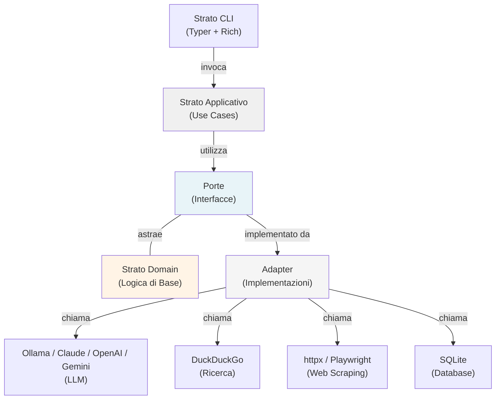

# SearchMuse

> Ricerca web intelligente alimentata da LLM

[](https://opensource.org/licenses/MIT)
[](https://www.python.org/downloads/)
[](./tests)
[](https://github.com/astral-sh/ruff)

## Panoramica

SearchMuse è un assistente di ricerca web intelligente che sfrutta modelli di linguaggio di grandi dimensioni per raffinare iterativamente le ricerche web e sintetizzare i risultati. A differenza dei tradizionali motori di ricerca, SearchMuse comprende gli obiettivi di ricerca a livello semantico, affinando continuamente le proprie query finché non scopre fonti esaustive.

Sviluppato in Python, SearchMuse supporta più provider LLM (Ollama, Claude, OpenAI, Gemini) combinando la flessibilità dei modelli cloud e locali con l'ampiezza della ricerca web. Ogni risultato è trasparentemente citato utilizzando attribuzioni di fonti in formato markdown, garantendo la piena tracciabilità delle informazioni.

## Caratteristiche

- **Raffinamento Iterativo della Ricerca**: Affina automaticamente le query di ricerca in base all'analisi semantica dei risultati iniziali
- **Supporto Multi-Provider LLM**: Ollama (locale, default), Claude, OpenAI e Gemini con gestione delle API key
- **Banner di Benvenuto Rich**: Banner a due colonne nel terminale con stato dei provider, tips e mascotte ASCII art
- **Citazione delle Fonti**: Ogni risultato include attribuzioni delle fonti in formato markdown con URL e date di pubblicazione
- **Strategie di Scraping Multiple**: Combina httpx per richieste leggere e Playwright per siti con contenuto dinamico
- **Estrazione di Contenuti**: Utilizza trafilatura e readability-lxml per l'analisi accurata del corpo degli articoli
- **Architettura Asincrona**: Operazioni concorrenti non-bloccanti per prestazioni ottimali con più fonti
- **Open Source**: Completamente concesso in licenza MIT, sviluppo trasparente e miglioramenti guidati dalla comunità

## Download

### Prerequisiti

Prima di iniziare, assicurati di avere:

- **Python 3.11 o superiore** installato ([scarica](https://www.python.org/downloads/))
- **pip** gestore pacchetti (incluso con Python)
- **git** per clonare il repository ([scarica](https://git-scm.com/downloads))

### Clonare il repository

```bash
git clone https://github.com/yourusername/SearchMuse.git
cd SearchMuse
```

Se vuoi scaricare solo una versione specifica:

```bash
git clone --branch v0.1.0 --depth 1 https://github.com/yourusername/SearchMuse.git
cd SearchMuse
```

## Installazione

### Installazione per uso quotidiano (utente finale)

Se vuoi semplicemente usare SearchMuse senza modificare il codice sorgente:

```bash
# Installa come pacchetto definitivo nel tuo ambiente Python
pip install .

# Oppure con tutti i provider cloud e keyring inclusi
pip install ".[all-providers]"
```

Questo installa SearchMuse come pacchetto stabile. Il comando `searchmuse` diventa disponibile globalmente nel terminale. Non serve tenere la cartella del repository dopo l'installazione.

Se in futuro vuoi aggiornare SearchMuse a una nuova versione:

```bash
cd SearchMuse
git pull
pip install .
```

### Installazione in modalità sviluppo (editable)

Se vuoi modificare il codice sorgente e vedere immediatamente le modifiche senza reinstallare:

```bash
# Solo Ollama (provider locale di default)
pip install -e .

# Con provider cloud specifici
pip install -e ".[claude]"       # Claude (Anthropic)
pip install -e ".[openai]"       # OpenAI
pip install -e ".[gemini]"       # Google Gemini

# Tutti i provider + keyring per archiviazione sicura delle API key
pip install -e ".[all-providers]"

# Per contribuire: include test runner, linter e type checker
pip install -e ".[dev]"
```

Il flag `-e` (editable) crea un link simbolico: ogni modifica al codice sorgente si riflette immediatamente senza dover reinstallare.

### Verifica dell'installazione

Dopo l'installazione, il comando `searchmuse` dovrebbe essere disponibile globalmente nel terminale:

```bash
searchmuse --version
# Output: SearchMuse v0.1.0
```

### Configurazione del provider LLM

**Opzione A: Ollama (locale, gratuito, privacy-first)**

1. Installa Ollama da [ollama.ai](https://ollama.ai)
2. Scarica un modello:

```bash
ollama pull mistral
```

3. Assicurati che Ollama sia in esecuzione (default: http://localhost:11434)

**Opzione B: Provider cloud (Claude, OpenAI, Gemini)**

Salva la tua API key in modo sicuro nel keyring di sistema:

```bash
# Installa prima il supporto keyring
pip install -e ".[keyring]"

# Poi salva la tua chiave
searchmuse config set-key claude sk-ant-la-tua-chiave
searchmuse config set-key openai sk-la-tua-chiave
searchmuse config set-key gemini la-tua-chiave
```

In alternativa, imposta la chiave tramite variabile d'ambiente:

```bash
export ANTHROPIC_API_KEY="sk-ant-la-tua-chiave"
export OPENAI_API_KEY="sk-la-tua-chiave"
export GOOGLE_API_KEY="la-tua-chiave"
```

Verifica la configurazione:

```bash
searchmuse config check
```

## Utilizzo

Dopo l'installazione, SearchMuse è disponibile come comando `searchmuse` nel tuo terminale.

### Comandi principali

```bash
# Esegui una query di ricerca (comando principale)
searchmuse search "Quali sono gli ultimi sviluppi nell'informatica quantistica?"

# Cambia provider LLM
searchmuse search "tendenze machine learning 2026" -p claude

# Imposta un modello specifico
searchmuse search "sicurezza IA" -p openai -m gpt-4o

# Limita le iterazioni di ricerca
searchmuse search "deep learning" -i 3

# Output JSON (per uso programmatico)
searchmuse search "progressi sicurezza IA" -f json

# Modalità silenziosa (nessun banner, nessun indicatore di progresso)
searchmuse search "query di test" -q
```

### Comandi di configurazione

```bash
# Mostra la configurazione risolta
searchmuse config show

# Verifica la connettività dei servizi
searchmuse config check

# Salva una API key
searchmuse config set-key <provider> <chiave>

# Visualizza una API key salvata (mascherata)
searchmuse config get-key <provider>
```

### Configurazione personalizzata

Crea un file `searchmuse.yaml` e passalo con `-c`:

```bash
searchmuse search "la mia query" -c ./mia-config.yaml
```

Consulta il [Riferimento Configurazione](docs/002_technical/005_configuration-reference.md) per tutte le opzioni disponibili.

### Riferimento completo CLI

```bash
searchmuse --help           # Mostra tutti i comandi
searchmuse search --help    # Mostra le opzioni di ricerca
searchmuse config --help    # Mostra i sottocomandi di configurazione
```

## Banner di Benvenuto

Quando esegui una ricerca, SearchMuse mostra un banner a due colonne con lo stato dei provider:

```
-- SearchMuse v0.1.0 ----------------------------------------------------------
|                                  |                                           |
|   Welcome to SearchMuse!         |  Tips for getting started                 |
|                                  |  searchmuse search "your query"           |
|        🔍📚                      |  Use -p claude to switch provider         |
|     .--------.                   |  searchmuse config check                  |
|     | ◉    ◉ |                   |                                           |
|     |  ‿‿‿‿  |                   |  Provider status                          |
|     |  MUSE  |                   |  ✓ ollama · mistral                       |
|     '--------'                   |  ✗ claude · (no API key)                  |
|                                  |  ✗ openai · (no API key)                  |
|   ollama · mistral               |  ✗ gemini · (no API key)                  |
|   /home/user/project             |                                           |
|                                  |                                           |
--------------------------------------------------------------------------------
```

## Architettura

SearchMuse segue un modello di architettura esagonale (clean), separando la logica di business dalle preoccupazioni infrastrutturali:



## Stack Tecnologico

| Componente | Tecnologia | Scopo |
|-----------|-----------|---------|
| Client HTTP | httpx | Richieste HTTP asincrone leggere |
| Automazione Browser | Playwright | Rendering e interazione JavaScript |
| Estrazione Contenuti | trafilatura | Analisi del corpo dell'articolo e metadati |
| Parsing HTML | beautifulsoup4 & readability-lxml | Estrazione di contenuti alternativa |
| Motore di Ricerca | DuckDuckGo | Ricerca web rispettosa della privacy |
| Integrazione LLM | Ollama, Claude, OpenAI, Gemini | Ragionamento semantico e raffinamento query |
| Framework CLI | Typer | Interfaccia a riga di comando user-friendly |
| Output Terminale | Rich | Output della console formattato con colori e tabelle |
| Configurazione | PyYAML | Gestione della configurazione in YAML |
| Database | SQLite & aiosqlite | Archiviazione asincrona e recupero di documenti |

## Documentazione

La documentazione completa è disponibile nella directory `docs/`:

### Documentazione Funzionale (`docs/001_functional/`)

| # | Documento | Descrizione |
|---|----------|-------------|
| 001 | [Visione e Obiettivi](docs/001_functional/001_vision-and-goals.md) | Visione del progetto, principi, criteri di successo |
| 002 | [Casi d'Uso](docs/001_functional/002_use-cases.md) | Scenari reali e user stories |
| 003 | [Specifiche Funzionalità](docs/001_functional/003_feature-specifications.md) | Specifiche dettagliate delle 6 feature principali |
| 004 | [Algoritmo di Raffinamento](docs/001_functional/004_search-refinement-algorithm.md) | Algoritmo iterativo con flowchart |
| 005 | [Citazione Fonti](docs/001_functional/005_source-citation.md) | Sistema di citazione, formati, validazione |
| 006 | [Siti Supportati](docs/001_functional/006_supported-websites.md) | Categorie siti e livelli di supporto |
| 007 | [Requisiti LLM](docs/001_functional/007_llm-requirements.md) | Selezione modello, hardware, guide setup |
| 008 | [Formati Input/Output](docs/001_functional/008_input-output-formats.md) | Formati API, esempi, schemi JSON |
| 009 | [Limitazioni](docs/001_functional/009_limitations.md) | Vincoli noti e mitigazioni |
| 010 | [Roadmap](docs/001_functional/010_roadmap.md) | Piano di rilascio versionato e priorità |

### Documentazione Tecnica (`docs/002_technical/`)

| # | Documento | Descrizione |
|---|----------|-------------|
| 001 | [Architettura](docs/002_technical/001_architecture.md) | Architettura esagonale e ADR |
| 002 | [Componenti](docs/002_technical/002_components.md) | Descrizione dettagliata dei componenti |
| 003 | [Flusso Dati](docs/002_technical/003_data-flow.md) | Flusso dei dati nel sistema |
| 004 | [Riferimento API](docs/002_technical/004_api-reference.md) | Classi di dominio e interfacce |
| 005 | [Riferimento Configurazione](docs/002_technical/005_configuration-reference.md) | Tutte le opzioni di configurazione |
| 006 | [Setup Sviluppo](docs/002_technical/006_development-setup.md) | Configurazione ambiente sviluppatore |
| 007 | [Strategia di Test](docs/002_technical/007_testing-strategy.md) | Approccio TDD e framework di test |
| 008 | [Deployment](docs/002_technical/008_deployment.md) | Guida distribuzione e produzione |
| 009 | [Sicurezza](docs/002_technical/009_security.md) | Considerazioni sulla sicurezza |
| 010 | [Contribuire](docs/002_technical/010_contributing.md) | Linee guida per i contributi |

### Documentazione in Italiano (`docs/003_it/`)

Traduzione completa in italiano disponibile in `docs/003_it/` con la stessa struttura numerata.

## Contribuire

Accogliamo con entusiasmo i contributi dalla comunità! Ecco come iniziare:

### 1. Fork e clone

```bash
# Fai il fork del repository su GitHub, poi:
git clone https://github.com/IL-TUO-USERNAME/SearchMuse.git
cd SearchMuse
```

### 2. Crea un ambiente virtuale

```bash
python3 -m venv .venv
source .venv/bin/activate   # Linux/macOS
# .venv\Scripts\activate    # Windows
```

### 3. Installa in modalità sviluppo

```bash
pip install -e ".[dev,all-providers]"
```

### 4. Crea un branch per la feature

```bash
git checkout -b feat/la-mia-nuova-feature
```

### 5. Apporta le modifiche

Segui le convenzioni del progetto:

- **Stile codice**: `ruff check .` e `ruff format .` devono passare
- **Sicurezza dei tipi**: `mypy src/searchmuse/` deve passare con zero errori
- **Test**: `pytest tests/ -v` deve passare (copertura minima 80%)
- **Immutabilità**: Non mutare mai gli oggetti; crea sempre nuove copie
- **File piccoli**: Mantieni i file sotto le 800 righe, le funzioni sotto le 50 righe

### 6. Esegui la suite di verifica completa

```bash
ruff check src/ tests/
mypy src/searchmuse/
pytest tests/ -v
```

### 7. Commit e push

```bash
git add <i-tuoi-file>
git commit -m "feat: descrizione della modifica"
git push origin feat/la-mia-nuova-feature
```

### 8. Apri una Pull Request

Apri una PR su GitHub verso il branch `main`. Includi:

- Una descrizione chiara della modifica
- Un piano di test
- Link a eventuali issue correlate

Per tutti i dettagli, consulta la [Guida ai Contributi](docs/002_technical/010_contributing.md).

## Licenza

SearchMuse è rilasciato sotto la Licenza MIT. Vedi il file [LICENSE](LICENSE) per i dettagli.
