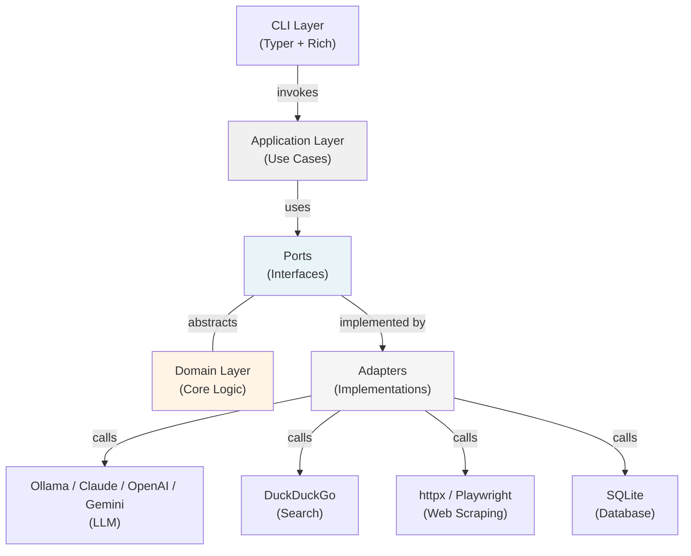

# SearchMuse

> Intelligent web research powered by LLMs

[](https://opensource.org/licenses/MIT)
[](https://www.python.org/downloads/)
[](./tests)
[](https://github.com/astral-sh/ruff)

## Overview

SearchMuse is an intelligent web research assistant that leverages large language models to iteratively refine web searches and synthesize findings. Unlike traditional search tools, SearchMuse understands research goals at a semantic level, continuously refining its queries until comprehensive sources are discovered.

Built with Python, SearchMuse supports multiple LLM providers (Ollama, Claude, OpenAI, Gemini) combining the flexibility of cloud and local LLMs with the breadth of web search. Every finding is transparently cited using markdown-formatted source attribution, ensuring full traceability of information.

## Features

- **Iterative Search Refinement**: Automatically refines search queries based on semantic analysis of initial results
- **Multi-Provider LLM Support**: Ollama (local, default), Claude, OpenAI, and Gemini with API key management
- **Rich Welcome Banner**: Two-column terminal banner showing provider status, tips, and ASCII art mascot
- **Source Citation**: Every finding includes markdown-formatted source attribution with URLs and publication dates
- **Multiple Scraping Strategies**: Combines httpx for lightweight requests and Playwright for JavaScript-heavy sites
- **Content Extraction**: Uses trafilatura and readability-lxml for accurate article content parsing
- **Async Architecture**: Non-blocking concurrent operations for optimal performance with multiple sources
- **Open Source**: Fully licensed under MIT, transparent development, and community-driven improvements

## Download

### Prerequisites

Before you begin, make sure you have:

- **Python 3.11 or higher** installed ([download](https://www.python.org/downloads/))
- **pip** package manager (included with Python)
- **git** for cloning the repository ([download](https://git-scm.com/downloads))

### Clone the repository

```bash
git clone https://github.com/yourusername/SearchMuse.git
cd SearchMuse
```

If you only want to download a specific version:

```bash
git clone --branch v0.1.0 --depth 1 https://github.com/yourusername/SearchMuse.git
cd SearchMuse
```

## Installation

### Installation for daily use (end user)

If you simply want to use SearchMuse without modifying the source code:

```bash
# Install as a stable package in your Python environment
pip install .

# Or with all cloud providers and keyring included
pip install ".[all-providers]"
```

This installs SearchMuse as a stable package. The `searchmuse` command becomes globally available in your terminal. You don't need to keep the repository folder after installation.

To update SearchMuse to a new version later:

```bash
cd SearchMuse
git pull
pip install .
```

### Installation in development mode (editable)

If you want to modify the source code and see changes immediately without reinstalling:

```bash
# Ollama only (default local provider)
pip install -e .

# With specific cloud providers
pip install -e ".[claude]"       # Claude (Anthropic)
pip install -e ".[openai]"       # OpenAI
pip install -e ".[gemini]"       # Google Gemini

# All providers + keyring for secure API key storage
pip install -e ".[all-providers]"

# For contributors: includes test runner, linter, and type checker
pip install -e ".[dev]"
```

The `-e` (editable) flag creates a symbolic link: any change to the source code is reflected immediately without reinstalling.

### Verify installation

After installation, the `searchmuse` command should be available globally in your terminal:

```bash
searchmuse --version
# Output: SearchMuse v0.1.0
```

### Setup your LLM provider

**Option A: Ollama (local, free, privacy-first)**

1. Install Ollama from [ollama.ai](https://ollama.ai)
2. Pull a model:

```bash
ollama pull mistral
```

3. Make sure Ollama is running (default: http://localhost:11434)

**Option B: Cloud providers (Claude, OpenAI, Gemini)**

Store your API key securely in the system keyring:

```bash
# Install keyring support first
pip install -e ".[keyring]"

# Then store your key
searchmuse config set-key claude sk-ant-your-key-here
searchmuse config set-key openai sk-your-key-here
searchmuse config set-key gemini your-key-here
```

Alternatively, set the key via environment variable:

```bash
export ANTHROPIC_API_KEY="sk-ant-your-key"
export OPENAI_API_KEY="sk-your-key"
export GOOGLE_API_KEY="your-key"
```

Verify your setup:

```bash
searchmuse config check
```

## Usage

After installation, SearchMuse is available as the `searchmuse` command in your terminal.

### Core commands

```bash
# Run a research query (main command)
searchmuse search "What are the latest developments in quantum computing?"

# Switch LLM provider
searchmuse search "machine learning trends 2026" -p claude

# Set a specific model
searchmuse search "AI safety" -p openai -m gpt-4o

# Limit search iterations
searchmuse search "deep learning" -i 3

# JSON output (for programmatic use)
searchmuse search "AI safety breakthroughs" -f json

# Quiet mode (no banner, no progress spinner)
searchmuse search "test query" -q
```

### Configuration commands

```bash
# Show resolved configuration
searchmuse config show

# Check service connectivity
searchmuse config check

# Store an API key
searchmuse config set-key <provider> <key>

# View a stored API key (masked)
searchmuse config get-key <provider>
```

### Custom configuration

Create a `searchmuse.yaml` file and pass it with `-c`:

```bash
searchmuse search "my query" -c ./my-config.yaml
```

See [Configuration Reference](docs/002_technical/005_configuration-reference.md) for all available options.

### Full CLI reference

```bash
searchmuse --help           # Show all commands
searchmuse search --help    # Show search options
searchmuse config --help    # Show config subcommands
```

## Welcome Banner

When you run a search, SearchMuse displays a rich two-column banner with provider status:

```
-- SearchMuse v0.1.0 ----------------------------------------------------------
|                                  |                                           |
|   Welcome to SearchMuse!         |  Tips for getting started                 |
|                                  |  searchmuse search "your query"           |
|        🔍📚                      |  Use -p claude to switch provider         |
|     .--------.                   |  searchmuse config check                  |
|     | ◉    ◉ |                   |                                           |
|     |  ‿‿‿‿  |                   |  Provider status                          |
|     |  MUSE  |                   |  ✓ ollama · mistral                       |
|     '--------'                   |  ✗ claude · (no API key)                  |
|                                  |  ✗ openai · (no API key)                  |
|   ollama · mistral               |  ✗ gemini · (no API key)                  |
|   /home/user/project             |                                           |
|                                  |                                           |
--------------------------------------------------------------------------------
```

## Architecture

SearchMuse follows a hexagonal (clean) architecture pattern, separating business logic from infrastructure concerns:



## Tech Stack

| Component | Technology | Purpose |
|-----------|-----------|---------|
| HTTP Client | httpx | Lightweight async HTTP requests |
| Browser Automation | Playwright | JavaScript rendering and interaction |
| Content Extraction | trafilatura | Article body and metadata parsing |
| HTML Parsing | beautifulsoup4 & readability-lxml | Fallback content extraction |
| Search Engine | DuckDuckGo | Privacy-respecting web search |
| LLM Integration | Ollama, Claude, OpenAI, Gemini | Semantic reasoning and query refinement |
| CLI Framework | Typer | User-friendly command-line interface |
| Terminal Output | Rich | Formatted console output with colors and tables |
| Configuration | PyYAML | YAML-based configuration management |
| Database | SQLite & aiosqlite | Async document storage and retrieval |

## Documentation

Comprehensive documentation is available in the `docs/` directory:

### Functional Documentation (`docs/001_functional/`)

| # | Document | Description |
|---|----------|-------------|
| 001 | [Vision and Goals](docs/001_functional/001_vision-and-goals.md) | Project vision, design principles, success criteria |
| 002 | [Use Cases](docs/001_functional/002_use-cases.md) | Real-world scenarios and user stories |
| 003 | [Feature Specifications](docs/001_functional/003_feature-specifications.md) | Detailed specs for all 6 core features |
| 004 | [Search Refinement Algorithm](docs/001_functional/004_search-refinement-algorithm.md) | Core iterative algorithm with flowcharts |
| 005 | [Source Citation](docs/001_functional/005_source-citation.md) | Citation system, formats, and validation |
| 006 | [Supported Websites](docs/001_functional/006_supported-websites.md) | Site categories and support levels |
| 007 | [LLM Requirements](docs/001_functional/007_llm-requirements.md) | Model selection, hardware, setup guides |
| 008 | [Input/Output Formats](docs/001_functional/008_input-output-formats.md) | API formats, examples, JSON schemas |
| 009 | [Limitations](docs/001_functional/009_limitations.md) | Known constraints and mitigations |
| 010 | [Roadmap](docs/001_functional/010_roadmap.md) | Versioned release plan and priorities |

### Technical Documentation (`docs/002_technical/`)

| # | Document | Description |
|---|----------|-------------|
| 001 | [Architecture](docs/002_technical/001_architecture.md) | Hexagonal architecture and ADRs |
| 002 | [Components](docs/002_technical/002_components.md) | Detailed component descriptions |
| 003 | [Data Flow](docs/002_technical/003_data-flow.md) | Data flow through the system |
| 004 | [API Reference](docs/002_technical/004_api-reference.md) | Domain classes and interfaces |
| 005 | [Configuration Reference](docs/002_technical/005_configuration-reference.md) | All configuration options |
| 006 | [Development Setup](docs/002_technical/006_development-setup.md) | Developer environment setup |
| 007 | [Testing Strategy](docs/002_technical/007_testing-strategy.md) | TDD approach and test framework |
| 008 | [Deployment](docs/002_technical/008_deployment.md) | Deployment and production guide |
| 009 | [Security](docs/002_technical/009_security.md) | Security considerations |
| 010 | [Contributing](docs/002_technical/010_contributing.md) | Contribution guidelines |

### Italian Documentation (`docs/003_it/`)

Full Italian translation available in `docs/003_it/` with the same numbered structure.

## Contributing

We welcome contributions from the community! Here is how to get started:

### 1. Fork and clone

```bash
# Fork the repository on GitHub, then:
git clone https://github.com/YOUR-USERNAME/SearchMuse.git
cd SearchMuse
```

### 2. Create a virtual environment

```bash
python3 -m venv .venv
source .venv/bin/activate   # Linux/macOS
# .venv\Scripts\activate    # Windows
```

### 3. Install in development mode

```bash
pip install -e ".[dev,all-providers]"
```

### 4. Create a feature branch

```bash
git checkout -b feat/my-new-feature
```

### 5. Make your changes

Follow the project conventions:

- **Code style**: `ruff check .` and `ruff format .` must pass
- **Type safety**: `mypy src/searchmuse/` must pass with zero errors
- **Tests**: `pytest tests/ -v` must pass (minimum 80% coverage)
- **Immutability**: Never mutate objects; create new copies instead
- **Small files**: Keep files under 800 lines, functions under 50 lines

### 6. Run the full verification suite

```bash
ruff check src/ tests/
mypy src/searchmuse/
pytest tests/ -v
```

### 7. Commit and push

```bash
git add <your-files>
git commit -m "feat: description of your change"
git push origin feat/my-new-feature
```

### 8. Open a Pull Request

Open a PR on GitHub targeting the `main` branch. Include:

- A clear description of the change
- A test plan
- Link to any related issues

For full details, see the [Contributing Guide](docs/002_technical/010_contributing.md).

## License

SearchMuse is released under the MIT License. See [LICENSE](LICENSE) file for details.
