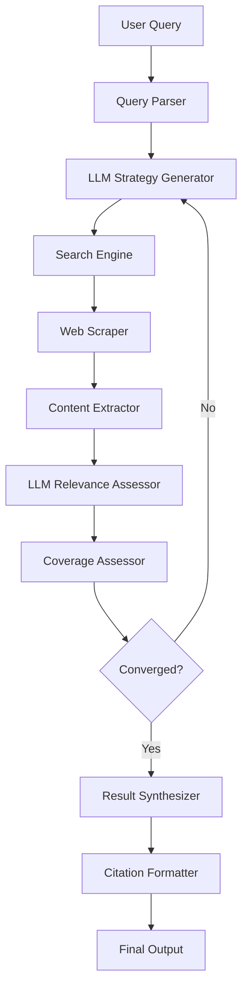

# SearchMuse Feature Specifications

## Feature Architecture Overview



## Feature 1: Iterative Search

### Overview
SearchMuse implements an intelligent search refinement loop that automatically improves result coverage through multiple iterations without user intervention.

### Workflow
1. **Query Normalization**: Parse user input, extract key terms and intent
2. **Strategy Generation**: LLM analyzes query and generates search strategy
   - Primary search terms and synonyms
   - Domain suggestions (academic, technical, news, etc.)
   - Search order and priority
3. **Execute Search**: Query DuckDuckGo with generated terms
4. **Content Extraction**: Scrape top 10-20 results
5. **Relevance Assessment**: LLM evaluates each source for relevance to original query
6. **Coverage Assessment**: LLM determines if sources adequately address query
7. **Convergence Check**: If coverage sufficient, move to synthesis
8. **Strategy Refinement**: If not converged, LLM performs gap analysis and generates refined strategy
9. **Repeat**: Execute iterations 3-8 until convergence or max iterations

### Configuration
```yaml
search:
  max_iterations: 5
  min_sources: 5
  coverage_threshold: 0.7  # 0.0-1.0
  results_per_query: 15
  timeout_per_source: 10s  # seconds
```

### Outputs per Iteration
- List of sources retrieved
- Relevance scores (0.0-1.0)
- Coverage assessment
- Identified gaps for next iteration

## Feature 2: Source Citation

### Philosophy
Every claim in SearchMuse output is traceable to its source. Citations are integral to the system, not an afterthought.

### Citation Data Model
```python
Citation(
    index: int,           # Reference number [1], [2], etc.
    source_id: str,       # Unique identifier
    url: str,             # Full URL
    title: str,           # Page title
    author: str | None,   # Author if available
    publication_date: str | None,  # ISO 8601 format
    access_date: str,     # When SearchMuse accessed it
    excerpt: str | None   # Optional relevant quote
)
```

### Citation Formats

#### Markdown (Default)
```markdown
This is a claim[1] supported by evidence[2].

## References

[1] "Page Title", Author Name, https://example.com/page
[2] "Another Page", https://example.org/article
```

#### HTML
```html
<p>This is a claim<sup><a href="#ref1">[1]</a></sup>.</p>
<ol id="references">
  <li id="ref1"><a href="https://example.com">Page Title</a>, Author</li>
</ol>
```

#### APA-Style
```
This is a claim (Author, 2024).

References

Author, A. A. (2024). Page title. Retrieved from https://example.com
```

### Citation Extraction Process
1. As content is extracted from each source, citation metadata is captured
2. LLM identifies specific claims from source content
3. Each claim mapped to citation index
4. Citation list compiled with full metadata
5. Output formatter applies selected citation style

## Feature 3: Content Extraction

### Primary Strategy: Trafilatura
- Extracts main content from HTML
- Removes boilerplate, ads, navigation
- Preserves text structure
- Fast and lightweight

### Fallback Strategy: Readability-lxml
- Alternative extraction engine for sites trafilatura struggles with
- Uses browser-like content classification
- Slower but more reliable on complex layouts

### Extraction Pipeline
```python
def extract_content(html: str) -> ExtractedContent:
    # Attempt trafilatura extraction
    content = trafilatura.extract(html)
    if not content or len(content) < MIN_WORDS:
        # Fallback to readability
        content = readability_extract(html)

    return ExtractedContent(
        main_text=content,
        title=extract_title(html),
        author=extract_author(html),
        publish_date=extract_date(html)
    )
```

### Quality Metrics
- Minimum content length: 100 words (configurable)
- Text-to-HTML ratio: >0.15 (not mostly markup)
- Encoding detection: UTF-8 or auto-detected

## Feature 4: LLM Integration via Ollama

### Model Options
- **mistral** (default): Balanced speed/quality, ~7B parameters
- **llama3**: Better reasoning, ~13B parameters
- **phi3**: Smaller/faster, ~3.8B parameters

### LLM Tasks

#### Strategy Generation
Input: User query, previous search results (if iterating)
Output: List of search terms, domain preferences, search order
Temperature: 0.7 (creative but focused)

#### Relevance Assessment
Input: Query, source content
Output: Relevance score 0.0-1.0, brief justification
Temperature: 0.3 (deterministic)

#### Coverage Assessment
Input: Query, all retrieved sources and their content
Output: Coverage score 0.0-1.0, identified gaps
Temperature: 0.3 (deterministic)

#### Result Synthesis
Input: Query, all sources, relevance scores
Output: Coherent answer with inline citations
Temperature: 0.5 (balanced)

### Configuration
```yaml
llm:
  provider: ollama
  model: mistral
  base_url: http://localhost:11434
  timeout: 60s
  temperature:
    strategy: 0.7
    relevance: 0.3
    coverage: 0.3
    synthesis: 0.5
```

## Feature 5: Multi-Strategy Scraping

### HTTP Scraping (httpx)
- Used for static HTML sites
- Fast and resource-efficient
- Respects robots.txt

### Dynamic Scraping (Playwright)
- Used for JavaScript-heavy sites
- Waits for content rendering
- More resource-intensive

### Strategy Selection
```python
def select_scraper(url: str) -> ScraperType:
    # Check robots.txt first
    if blocked_by_robots_txt(url):
        return ScraperType.BLOCKED

    # Heuristics: common JS frameworks indicate need for Playwright
    if likely_js_heavy(url):
        return ScraperType.PLAYWRIGHT

    return ScraperType.HTTPX
```

### robots.txt Compliance
- Check robots.txt before scraping
- Respect Disallow rules for user-agent "searchmuse"
- Rate limiting: 1 second between requests to same domain
- User-Agent string identifies SearchMuse

## Feature 6: Result Synthesis

### Synthesis Process
1. LLM receives all retrieved sources and their content
2. LLM generates coherent answer addressing original query
3. Inline citations added as references are made
4. Citation list compiled
5. Output formatted in selected style

### Quality Assurance
- Verify all citations referenced in text exist
- Check for hallucinated sources (LLM-invented references)
- Validate source URLs are functional
- Ensure comprehensive coverage of query intent

### Example Output
```
# Research Results: Zero-Knowledge Proofs

Zero-knowledge proofs (ZKPs) are cryptographic protocols that allow one party
to prove they know a fact without revealing the fact itself[1]. This technique
has applications in blockchain, privacy-preserving authentication, and more[2].

## Key Applications

ZKPs are increasingly used in blockchain systems for transaction privacy[3] and
in authentication systems for password-free login[4].

## References

[1] "Zero-Knowledge Proof", Wikipedia, https://en.wikipedia.org/wiki/Zero-knowledge_proof
[2] "Understanding Zero-Knowledge Proofs", Author Name, https://example.com/zk-guide
[3] "Privacy in Blockchain", Journal of Cryptography, https://example.com/zk-blockchain
[4] "Zero-Knowledge Authentication", Security Today, https://example.com/auth-zk
```
