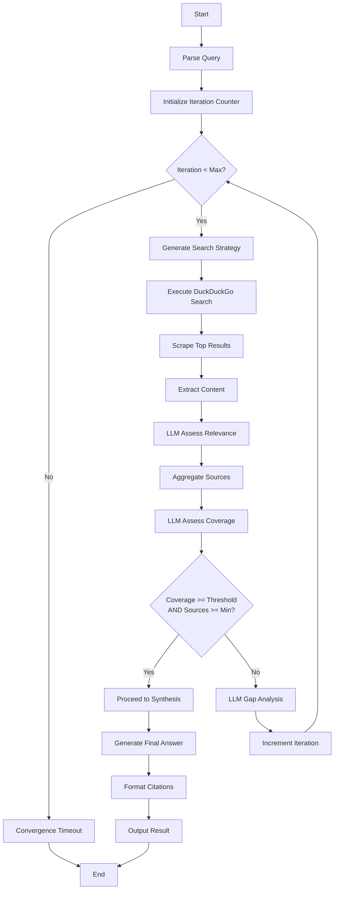

# SearchMuse Search Refinement Algorithm

## Algorithm Overview



## Detailed Algorithm Steps

### Step 1: Query Parsing and Normalization
Prepare user input for processing.

```python
def parse_query(user_query: str) -> ParsedQuery:
    # Extract metadata
    language = detect_language(user_query)

    # Normalize text
    normalized = normalize_whitespace(user_query)

    # Tokenize for term extraction
    terms = extract_key_terms(normalized)

    return ParsedQuery(
        original=user_query,
        normalized=normalized,
        language=language,
        key_terms=terms
    )
```

**Output**: ParsedQuery object with normalized text and key terms

---

### Step 2: LLM Search Strategy Generation
Use LLM to create intelligent search strategy.

**Input**: Parsed query, previous results (if iterating)

**LLM Prompt Template**:
```
Generate a search strategy for finding comprehensive information about:
"{query}"

If this is iteration {iteration_num}, consider these gaps from previous search:
{identified_gaps}

Return search terms as a JSON list, ordered by priority.
Include domain preferences (academic, news, technical, etc.).
```

**Output**: SearchStrategy object
```python
SearchStrategy(
    search_terms: List[str],  # ["term1", "term2", ...]
    domain_preferences: List[str],  # ["site:github.com", "-site:pinterest.com"]
    estimated_quality: float,  # LLM confidence 0.0-1.0
    rationale: str  # Why this strategy was chosen
)
```

---

### Step 3: Execute Search
Query DuckDuckGo with generated strategy.

```python
def execute_search(strategy: SearchStrategy) -> List[SearchResult]:
    results = []
    for term in strategy.search_terms:
        query = term + " " + " ".join(strategy.domain_preferences)
        raw_results = duckduckgo.search(query, results=15)
        results.extend(raw_results)

    # Deduplicate and rank
    unique_results = deduplicate_by_url(results)
    ranked = rank_by_relevance(unique_results)

    return ranked[:20]  # Return top 20 unique results
```

**Output**: List of SearchResult objects with URL, title, snippet

---

### Step 4: Scrape Top Results
Retrieve HTML content from results.

```python
def scrape_results(results: List[SearchResult]) -> List[ScrapedContent]:
    scraped = []
    for result in results:
        try:
            # Select scraper strategy
            scraper = select_scraper(result.url)

            # Scrape with timeout
            html = scraper.fetch(result.url, timeout=10)

            scraped.append(ScrapedContent(
                url=result.url,
                html=html,
                timestamp=datetime.now()
            ))
        except Exception as e:
            log_scrape_error(result.url, e)
            continue

    return scraped
```

**Output**: List of ScrapedContent objects (HTML + metadata)

---

### Step 5: Extract Textual Content
Convert HTML to clean text using trafilatura/readability.

```python
def extract_content(scraped: List[ScrapedContent]) -> List[ExtractedContent]:
    extracted = []
    for item in scraped:
        try:
            # Primary extraction
            text = trafilatura.extract(item.html)

            # Fallback if insufficient content
            if not text or len(text) < 100:
                text = readability_extract(item.html)

            # Extract metadata
            title = extract_title(item.html, item.url)
            author = extract_author(item.html)
            pub_date = extract_publish_date(item.html)

            extracted.append(ExtractedContent(
                url=item.url,
                text=text,
                title=title,
                author=author,
                publish_date=pub_date
            ))
        except Exception as e:
            log_extraction_error(item.url, e)
            continue

    return extracted
```

**Output**: List of ExtractedContent objects (clean text + metadata)

---

### Step 6: LLM Relevance Assessment
Score each source for relevance to original query.

**LLM Prompt Template**:
```
Query: "{original_query}"

Source: "{title}"
URL: {url}
Content (first 500 words): "{content}"

On a scale of 0.0 to 1.0, rate the relevance of this source to the query.
Consider: clarity, authority, completeness, recency.

Return JSON: {"relevance_score": 0.X, "explanation": "..."}
```

**Output**: List of (ExtractedContent, relevance_score) pairs

```python
def assess_relevance(
    query: str,
    extracted_sources: List[ExtractedContent]
) -> List[Tuple[ExtractedContent, float]]:
    results = []
    for source in extracted_sources:
        prompt = create_relevance_prompt(query, source)
        response = llm.generate(prompt, temperature=0.3)
        score = parse_relevance_response(response)

        results.append((source, score))

    return results
```

---

### Step 7: LLM Coverage Assessment
Determine if combined sources adequately address the query.

**LLM Prompt Template**:
```
Query: "{original_query}"

Retrieved {num_sources} sources:
{sources_summary}

On a scale of 0.0 to 1.0, assess coverage of this query by these sources.
Consider: breadth of subtopics, depth of explanation, currency, diversity of perspectives.

Identify any significant gaps in coverage.

Return JSON: {
  "coverage_score": 0.X,
  "gaps": ["gap1", "gap2", ...],
  "explanation": "..."
}
```

**Coverage Score Formula**:
```
coverage = (
    0.4 * source_count_ratio +  # min(sources, target) / target
    0.3 * average_relevance +   # mean of all relevance scores
    0.3 * topic_diversity       # number of distinct subtopics covered
)
```

---

### Step 8: Convergence Decision

```python
def check_convergence(
    coverage_score: float,
    num_sources: int,
    max_iterations: int,
    current_iteration: int,
    config: SearchConfig
) -> Tuple[bool, str]:

    # Quality convergence
    quality_converged = coverage_score >= config.coverage_threshold

    # Quantity convergence
    quantity_converged = num_sources >= config.min_sources

    # Iteration limit
    iteration_limit_reached = current_iteration >= max_iterations

    if quality_converged and quantity_converged:
        return True, "Convergence: quality and quantity thresholds met"

    if iteration_limit_reached:
        return True, "Convergence: max iterations reached"

    return False, f"Continuing: coverage={coverage_score:.2f}, sources={num_sources}"
```

**Convergence Criteria** (must satisfy ALL):
- coverage_score >= 0.7
- num_sources >= min_sources (default: 5)
- OR max_iterations reached (default: 5)

---

### Step 9: Strategy Refinement (If Not Converged)
If convergence not achieved, LLM performs gap analysis.

**LLM Prompt Template**:
```
Query: "{original_query}"

Current coverage score: {coverage_score}
Identified gaps: {gaps}

Generate a new search strategy to address these gaps.
What additional search terms or domains should we try?

Avoid duplicating previous searches: {previous_terms}

Return JSON: {"new_search_terms": [...], "rationale": "..."}
```

---

### Step 10: Iteration Loop
Repeat steps 3-9 until convergence.

```python
def iterative_search(
    query: str,
    config: SearchConfig
) -> List[ExtractedContent]:
    all_sources = []
    iteration = 0

    while iteration < config.max_iterations:
        # Generate strategy
        if iteration == 0:
            strategy = generate_initial_strategy(query)
        else:
            gaps = identify_gaps(query, all_sources)
            strategy = refine_strategy(query, all_sources, gaps)

        # Search and extract
        search_results = execute_search(strategy)
        scraped = scrape_results(search_results)
        extracted = extract_content(scraped)

        # Assess and aggregate
        relevant_sources = assess_relevance(query, extracted)
        all_sources.extend(relevant_sources)

        # Check convergence
        coverage = assess_coverage(query, all_sources)
        converged, message = check_convergence(
            coverage.score,
            len(all_sources),
            config.max_iterations,
            iteration,
            config
        )

        log_iteration(iteration, message, coverage)

        if converged:
            break

        iteration += 1

    return all_sources
```

---

## Quality Score Details

### Coverage Score Components

**Source Count Ratio** (weight 0.4)
- Scales from 0 to 1.0
- 0.0 if fewer than min_sources
- 1.0 if >= target_sources (usually 10-15)
- Formula: min(actual_sources, target_sources) / target_sources

**Average Relevance** (weight 0.3)
- Mean of individual relevance scores (0.0-1.0)
- Minimum 0.4 average to be valuable
- Penalizes low-quality sources

**Topic Diversity** (weight 0.3)
- Number of distinct subtopics covered (LLM-identified)
- Normalized to 0.0-1.0
- Prevents redundant sources

### Final Coverage Formula
```
coverage_score = (
    (min(sources, 10) / 10) * 0.4 +
    mean(relevance_scores) * 0.3 +
    (distinct_topics / max_topics) * 0.3
)
```

## Configuration Reference

```yaml
search:
  max_iterations: 5
  min_sources: 5
  coverage_threshold: 0.7
  results_per_query: 15

extraction:
  min_content_length: 100
  timeout_per_source: 10s

llm:
  temperature_strategy: 0.7
  temperature_assessment: 0.3
```

## Performance Characteristics

- Average iterations: 1.5-3 (depends on query complexity)
- Time per iteration: 30-90 seconds
- Typical total time: 2-5 minutes
- Memory usage: 100-500 MB (depends on content size)
