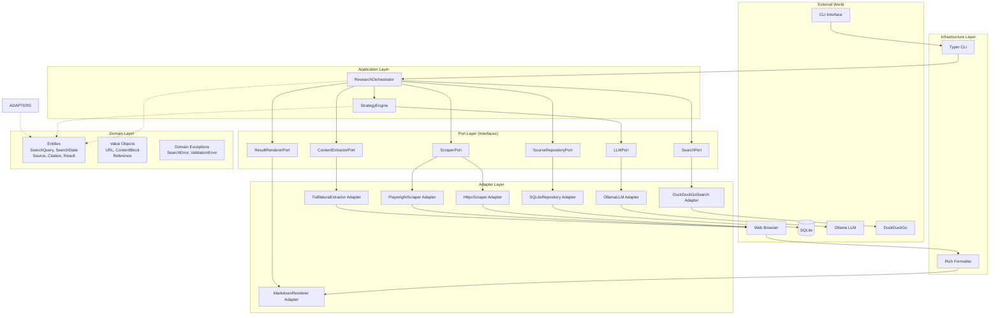

# :material-cog: SearchMuse Architecture

SearchMuse employs a **hexagonal architecture** (Ports & Adapters) to ensure clean separation of concerns, testability, and extensibility. This document describes the overall architecture, design decisions, and layer responsibilities.

## Hexagonal Architecture Overview

Hexagonal architecture organizes code into distinct layers, with dependencies pointing inward toward the domain layer. This ensures the domain logic (business rules) remains independent of implementation details.



## Layer Descriptions

### Domain Layer (Core)

The domain layer contains pure business logic with zero external dependencies. It defines:

- **Entities**: Core business objects with identity (SearchQuery, SearchState, Source)
- **Value Objects**: Immutable objects without identity (URL, Citation, ContentBlock)
- **Exceptions**: Domain-specific errors (SearchError, ValidationError, MaxIterationsExceeded)
- **Business Rules**: Logic for combining and validating data

Key principle: **All domain objects are frozen dataclasses** for immutability.

### Port Layer (Interfaces)

Ports define contracts for external services using Python Protocol interfaces:

- **LLMPort**: Language model integration
- **ScraperPort**: Web scraping abstraction
- **ContentExtractorPort**: Content extraction from HTML
- **SourceRepositoryPort**: Data persistence
- **ResultRendererPort**: Output formatting
- **SearchPort**: Search engine integration

Key principle: **Protocol over ABC** for maximum flexibility and runtime zero-cost.

### Adapter Layer (Implementation)

Adapters implement Port interfaces, integrating external libraries:

- **OllamaLLM**: Ollama integration via ollama-python
- **HttpxScraper**: Lightweight HTTP scraping via httpx
- **PlaywrightScraper**: JavaScript-capable scraping via playwright
- **TrafilaturaExtractor**: Content extraction via trafilatura
- **SQLiteRepository**: Persistent storage via aiosqlite
- **MarkdownRenderer**: Output formatting via rich
- **DuckDuckGoSearch**: Search via duckduckgo-search

Key principle: **Adapters are interchangeable** via dependency injection.

### Application Layer

Orchestrates domain logic and port interactions:

- **ResearchOrchestrator**: Manages overall research workflow
- **StrategyEngine**: Generates search strategies using LLM
- **ResultAggregator**: Combines results from multiple iterations

### Infrastructure Layer

Provides runtime infrastructure:

- **DependencyContainer**: Manages adapter instances and configuration
- **ConfigurationLoader**: Parses YAML and environment configuration
- **AsyncRuntime**: Handles async execution and error propagation

### CLI Layer

Exposes the application as command-line interface:

- **Typer Commands**: Research, configuration, history commands
- **Rich Output**: Formatted results in terminal

## Dependency Rule

**Dependencies point inward.** Outer layers depend on inner layers; inner layers never depend on outer layers.

```
External APIs (Ollama, DuckDuckGo, etc.)
           ↓
Adapters (OllamaLLM, HttpxScraper, etc.)
           ↓
Ports (Protocol interfaces)
           ↓
Application Layer (Orchestrators)
           ↓
Domain Layer (Entities, Value Objects, Exceptions)
```

Violations of this rule create tight coupling and reduce testability.

## Architecture Decision Records

### ADR-1: Hexagonal Architecture

**Decision:** Use hexagonal architecture (Ports & Adapters pattern).

**Rationale:**
- Domain logic isolated from external dependencies
- Easy to swap implementations (Ollama -> Claude -> open-source LLM)
- Testable without external services (mock ports)
- Clear separation of concerns
- Scalable as new adapters are added

**Status:** Accepted

---

### ADR-2: Frozen Dataclasses for Domain Objects

**Decision:** All domain entities and value objects are frozen dataclasses.

**Rationale:**
- Immutability prevents hidden side effects
- Hashable, can be used in sets and dicts
- Reduced cognitive load (no mutation tracking)
- Thread-safe by default
- Better memory efficiency than traditional classes

**Status:** Accepted

---

### ADR-3: Protocol over ABC

**Decision:** Use Python Protocol for port interfaces instead of ABC.

**Rationale:**
- Structural typing: no explicit inheritance required
- Adapters can implement multiple protocols
- Zero runtime cost (protocols are not classes)
- Better tooling support (type checkers understand protocols)
- More Pythonic for runtime duck typing

**Status:** Accepted

---

### ADR-4: Async-First Design

**Decision:** All I/O operations use async/await.

**Rationale:**
- Efficient handling of multiple concurrent requests
- Better resource utilization
- Scales to thousands of concurrent operations
- Cleaner than threading callbacks

**Status:** Accepted

---

### ADR-5: Configuration as YAML + Environment Variables

**Decision:** Configuration via YAML files with environment variable overrides.

**Rationale:**
- YAML is human-readable and version-controllable
- Environment variables enable containerized deployments
- Three-tier precedence (default -> custom -> env) prevents surprises
- No secrets in code or version control

**Status:** Accepted

## Cross-Layer Communication

Layers communicate through well-defined interfaces:

1. **CLI → Application**: Typer commands pass user input to orchestrators
2. **Application → Domain**: Orchestrators use domain entities and value objects
3. **Application → Ports**: Orchestrators depend on port interfaces (not implementations)
4. **Ports → Adapters**: Dependency injection provides concrete implementations
5. **Adapters → External**: Adapters call external services (Ollama, DuckDuckGo, etc.)

## Testing Implications

The architecture enables comprehensive testing:

- **Unit Tests**: Domain logic with no external dependencies
- **Integration Tests**: Adapters with real external services
- **E2E Tests**: Full research flow with mock search results
- **Contract Tests**: Port interfaces verified by adapters

See [Testing Strategy](007_testing-strategy.md) for details.

## Related Documentation

- [Components Guide](002_components.md) - Detailed component descriptions
- [Data Flow](003_data-flow.md) - How data moves through layers
- [API Reference](004_api-reference.md) - Domain classes and port interfaces
- [Contributing Guide](010_contributing.md) - Extending the architecture

---

Last updated: 2026-02-28
