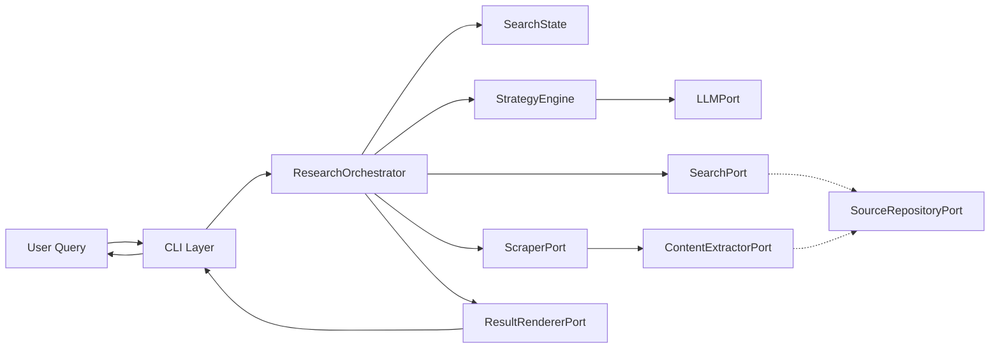

# SearchMuse Components

This document describes all major components in SearchMuse, their responsibilities, and interfaces. Understanding these components is essential for extending the system and contributing to the project.

## Domain Components

### SearchQuery

Represents a user research request.

```python
@dataclass(frozen=True)
class SearchQuery:
    text: str                      # Research question
    max_iterations: int = 5        # Max refinement cycles
    timeout_seconds: int = 300     # Total timeout
    language: str = "en"           # Result language
```

**Responsibilities:**
- Encapsulate user research intent
- Validate input constraints (length, timeout)
- Immutable by design

---

### SearchState

Tracks research progress across iterations.

```python
@dataclass(frozen=True)
class SearchState:
    query: SearchQuery
    iteration: int                 # Current iteration (0-based)
    previous_results: list[Source]
    gathered_evidence: list[ContentBlock]
    current_strategy: str          # Search strategy
    is_complete: bool = False
```

**Responsibilities:**
- Maintain research context between iterations
- Track evidence gathered so far
- Determine when to stop searching
- Support iteration logic

---

### Source

Represents a discovered web source.

```python
@dataclass(frozen=True)
class Source:
    url: str
    title: str
    summary: str
    relevance_score: float         # 0.0-1.0
    discovered_at: datetime
    extracted_content: ContentBlock | None = None
```

**Responsibilities:**
- Record source metadata and location
- Store relevance assessment
- Link to extracted content
- Support citation generation

---

### Citation

Represents a formal reference to a source.

```python
@dataclass(frozen=True)
class Citation:
    source: Source
    page_number: int | None = None
    accessed_at: datetime = field(default_factory=datetime.now)
    quote: str | None = None       # Relevant quote
```

**Responsibilities:**
- Format citations (APA, Chicago, MLA)
- Track access date for verification
- Link to specific quotes
- Support bibliography generation

---

### ContentBlock

Represents extracted content from a source.

```python
@dataclass(frozen=True)
class ContentBlock:
    text: str
    source_url: str
    blocks: list['ContentBlock'] = field(default_factory=list)  # Paragraphs
    metadata: dict[str, str] = field(default_factory=dict)
```

**Responsibilities:**
- Store extracted article content
- Maintain source reference
- Preserve content hierarchy
- Support content searching

---

### ResearchResult

Final output of a research session.

```python
@dataclass(frozen=True)
class ResearchResult:
    query: SearchQuery
    synthesis: str                 # AI-generated summary
    sources: list[Source]
    citations: list[Citation]
    evidence_blocks: list[ContentBlock]
    execution_time_seconds: float
    total_iterations: int
```

**Responsibilities:**
- Aggregate research outcomes
- Organize sources and citations
- Include execution metrics
- Support export and rendering

## Port Interfaces

Ports are Python Protocol interfaces defining contracts with external services.

### LLMPort

Strategy generation and result synthesis.

```python
class LLMPort(Protocol):
    async def generate_strategy(
        self,
        query: SearchQuery,
        previous_results: list[Source],
        iteration: int
    ) -> str:
        """Generate next search strategy."""
        ...

    async def synthesize_result(
        self,
        query: SearchQuery,
        sources: list[Source],
        evidence: list[ContentBlock]
    ) -> str:
        """Synthesize final research summary."""
        ...

    async def assess_relevance(
        self,
        query: SearchQuery,
        source: Source
    ) -> float:
        """Score source relevance (0.0-1.0)."""
        ...
```

**Implementations:**
- OllamaLLM (via Ollama, local models)
- OpenAI (paid, requires API key)
- AnthropicClaude (paid, requires API key)

---

### ScraperPort

Web content retrieval.

```python
class ScraperPort(Protocol):
    async def scrape(
        self,
        url: str,
        timeout_seconds: int = 10
    ) -> str:
        """Fetch page HTML/text."""
        ...

    async def scrape_with_javascript(
        self,
        url: str,
        timeout_seconds: int = 30
    ) -> str:
        """Fetch page after JS execution."""
        ...

    async def is_accessible(self, url: str) -> bool:
        """Check if URL is reachable."""
        ...
```

**Implementations:**
- HttpxScraper (lightweight, no JS)
- PlaywrightScraper (full browser, JS support)

---

### ContentExtractorPort

Content parsing and extraction.

```python
class ContentExtractorPort(Protocol):
    async def extract_article(
        self,
        html: str,
        source_url: str
    ) -> ContentBlock:
        """Extract article content."""
        ...

    async def extract_title(self, html: str) -> str:
        """Extract page title."""
        ...

    async def extract_summary(
        self,
        html: str,
        max_length: int = 200
    ) -> str:
        """Extract page summary."""
        ...
```

**Implementations:**
- TrafilaturaExtractor (trafilatura library)
- ReadabilityExtractor (readability-lxml library)

---

### SourceRepositoryPort

Persistent source storage.

```python
class SourceRepositoryPort(Protocol):
    async def save_source(self, source: Source) -> None:
        """Store discovered source."""
        ...

    async def find_source(self, url: str) -> Source | None:
        """Retrieve source by URL."""
        ...

    async def list_sources(
        self,
        query_text: str,
        limit: int = 100
    ) -> list[Source]:
        """List sources for query."""
        ...

    async def update_source(self, source: Source) -> None:
        """Update existing source."""
        ...
```

**Implementations:**
- SQLiteRepository (aiosqlite, file-based)
- PostgresRepository (async psycopg, server-based)

---

### SearchPort

Search engine integration.

```python
class SearchPort(Protocol):
    async def search(
        self,
        query: str,
        max_results: int = 10,
        language: str = "en"
    ) -> list[Source]:
        """Execute search query."""
        ...

    async def search_similar(
        self,
        source_url: str,
        max_results: int = 5
    ) -> list[Source]:
        """Find similar sources."""
        ...
```

**Implementations:**
- DuckDuckGoSearch (privacy-respecting)
- GoogleSearch (requires API key)
- BingSearch (requires API key)

---

### ResultRendererPort

Output formatting and presentation.

```python
class ResultRendererPort(Protocol):
    async def render_result(
        self,
        result: ResearchResult
    ) -> str:
        """Format result for display."""
        ...

    async def render_sources(
        self,
        sources: list[Source],
        format: str = "markdown"
    ) -> str:
        """Format sources list."""
        ...

    async def render_citations(
        self,
        citations: list[Citation],
        style: str = "apa"
    ) -> str:
        """Format bibliography."""
        ...
```

**Implementations:**
- MarkdownRenderer (markdown output)
- HTMLRenderer (HTML with CSS)
- JSONRenderer (machine-readable)

## Component Interaction



## Adapter Implementations

### OllamaLLM

**File:** `src/searchmuse/adapters/ollama_llm.py`

Implements LLMPort using Ollama local models.

**Configuration:**
- `ollama.base_url`: Ollama server URL (default: http://localhost:11434)
- `ollama.model`: Model name (default: mistral)
- `ollama.timeout_seconds`: Request timeout

**Features:**
- Prompt engineering for task-specific strategies
- Temperature control for consistency vs. creativity
- Context window awareness

---

### HttpxScraper

**File:** `src/searchmuse/adapters/httpx_scraper.py`

Lightweight HTTP-based scraping via httpx.

**Configuration:**
- `scraper.user_agent`: User-Agent header
- `scraper.timeout_seconds`: Request timeout
- `scraper.max_redirects`: Redirect following limit

**Features:**
- Async request handling
- Connection pooling
- Automatic retry on failure

---

### PlaywrightScraper

**File:** `src/searchmuse/adapters/playwright_scraper.py`

Full browser automation for JavaScript-heavy sites.

**Configuration:**
- `playwright.browser`: chromium, firefox, or webkit
- `playwright.headless`: Run without GUI
- `playwright.timeout_seconds`: Navigation timeout

**Features:**
- JavaScript execution
- Form interaction
- Screenshot capability

---

### TrafilaturaExtractor

**File:** `src/searchmuse/adapters/trafilatura_extractor.py`

Content extraction via trafilatura library.

**Features:**
- Article body extraction
- Metadata recovery (title, date, author)
- Table and code block preservation

---

### SQLiteRepository

**File:** `src/searchmuse/adapters/sqlite_repository.py`

File-based source storage via aiosqlite.

**Database Schema:**
- `sources` table: url, title, summary, relevance_score, discovered_at
- `content_blocks` table: source_id, text, metadata

**Features:**
- Async operations
- Index on URL for fast lookup
- Automatic schema creation

---

### MarkdownRenderer

**File:** `src/searchmuse/adapters/markdown_renderer.py`

Markdown output with rich formatting.

**Output Format:**
```markdown
# Research Result: [Query]

## Summary
[Synthesis]

## Sources (5 found)
1. [Title](URL) - [Relevance Score]
   Summary: [Summary]

## Full Citations
[APA-formatted bibliography]

## Evidence
[Extracted content blocks with quotes]
```

**Features:**
- Citation formatting
- Table generation
- Link preservation

## Related Documentation

- [Architecture Overview](001_architecture.md) - Overall system design
- [Data Flow](003_data-flow.md) - Component interactions during execution
- [API Reference](004_api-reference.md) - Complete class and method definitions
- [Contributing Guide](010_contributing.md) - Adding new adapters

---

Last updated: 2026-02-28
