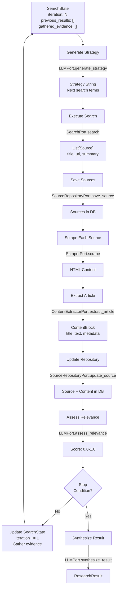
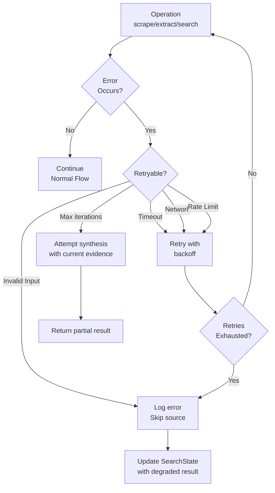

# SearchMuse Data Flow

This document describes how data flows through SearchMuse from initial user query to final research result. Understanding the data flow is crucial for debugging, extending, and optimizing the system.

## High-Level Research Flow

```mermaid
sequenceDiagram
    actor User
    participant CLI
    participant Orchestrator
    participant LLM
    participant Search
    participant Scraper
    participant Extractor
    participant Repository
    participant Renderer

    User->>CLI: searchmuse "What is quantum computing?"
    CLI->>Orchestrator: research(SearchQuery)

    loop Iteration 1-5
        Orchestrator->>LLM: generate_strategy(query, results)
        LLM-->>Orchestrator: "Search for: quantum computing basics"
        Orchestrator->>Search: search("quantum computing basics")
        Search-->>Orchestrator: [Source, Source, Source]

        par Parallel Scraping
            Orchestrator->>Scraper: scrape(url1)
            Orchestrator->>Scraper: scrape(url2)
            Orchestrator->>Scraper: scrape(url3)
        and Repository Update
            Orchestrator->>Repository: save_source(source)
        end

        Scraper-->>Orchestrator: html_content
        Orchestrator->>Extractor: extract_article(html)
        Extractor-->>Orchestrator: ContentBlock
        Orchestrator->>Repository: update_source(with_content)

        Orchestrator->>LLM: assess_relevance(query, source)
        LLM-->>Orchestrator: 0.95

        alt Stop Condition Met?
            Note over Orchestrator: Sufficient sources<br/>or max iterations
            Orchestrator->>LLM: synthesize_result(sources, evidence)
            LLM-->>Orchestrator: synthesis_text
            break
        end
    end

    Orchestrator->>Renderer: render(ResearchResult)
    Renderer-->>Orchestrator: markdown_output
    Orchestrator->>CLI: ResearchResult
    CLI-->>User: Formatted output
```

## Iteration-Level Data Flow

Each search iteration follows this cycle:



## Data Transformations

### Stage 1: Query to Strategy

**Input:** SearchQuery
```python
SearchQuery(
    text="What is quantum computing?",
    max_iterations=5,
    timeout_seconds=300,
    language="en"
)
```

**Processing:**
1. Validate query length and constraints
2. Pass to LLM with context from previous iteration
3. LLM generates refined search terms

**Output:** String
```
"quantum computing fundamentals qubits superposition entanglement"
```

---

### Stage 2: Strategy to Sources

**Input:** Strategy string

**Processing:**
1. Parse strategy terms
2. Execute search via SearchPort
3. Deduplicate against previously discovered sources
4. Return ranked source list

**Output:** List[Source]
```python
[
    Source(
        url="https://quantum.ibm.com/",
        title="IBM Quantum",
        summary="IBM's quantum computing platform...",
        relevance_score=0.87,
        discovered_at=datetime.now()
    ),
    # More sources...
]
```

---

### Stage 3: Source to Content

**Input:** Source with url only

**Processing:**
1. Fetch HTML via ScraperPort (httpx or playwright)
2. Extract article via ContentExtractorPort (trafilatura)
3. Update source with content and metadata

**Output:** Source with extracted_content
```python
Source(
    url="https://quantum.ibm.com/",
    title="IBM Quantum",
    summary="...",
    relevance_score=0.87,
    discovered_at=datetime.now(),
    extracted_content=ContentBlock(
        text="Quantum computing leverages quantum mechanics...",
        source_url="https://quantum.ibm.com/",
        blocks=[
            ContentBlock(text="Paragraph 1..."),
            ContentBlock(text="Paragraph 2..."),
        ]
    )
)
```

---

### Stage 4: Content to Relevance Score

**Input:** SearchQuery + Source

**Processing:**
1. Format LLM prompt with query and source summary
2. LLM scores relevance (0.0 = irrelevant, 1.0 = perfect match)
3. Filter low-relevance sources (threshold: 0.6)

**Output:** Float (0.0-1.0)

**Example Prompt:**
```
Research query: "What is quantum computing?"
Source title: "IBM Quantum"
Source summary: "IBM's quantum computing platform and services"

Rate relevance from 0.0 to 1.0:
```

**Example Response:** 0.95

---

### Stage 5: Evidence Gathering

**Input:** List[Source] with relevance scores

**Processing:**
1. Filter sources by relevance threshold
2. Extract content blocks from top sources
3. Chunk content into smaller blocks if needed
4. Organize chronologically and by relevance

**Output:** List[ContentBlock]
```python
[
    ContentBlock(
        text="Quantum computing is a type of...",
        source_url="https://quantum.ibm.com/",
        metadata={"source": "IBM Quantum", "relevance": 0.95}
    ),
    # More evidence blocks...
]
```

---

### Stage 6: Synthesis

**Input:**
- SearchQuery
- List[Source] (curated)
- List[ContentBlock] (evidence)

**Processing:**
1. Format LLM prompt with query and evidence
2. LLM generates comprehensive synthesis
3. Include citations in synthesis text

**Output:** String (synthesis)

**Example Prompt:**
```
Based on the following research evidence, provide a comprehensive
answer to the query.

Query: "What is quantum computing?"

Evidence:
1. [Source 1]: Quantum computing is...
2. [Source 2]: Key principles include...

Provide a well-sourced, detailed answer.
```

---

### Stage 7: Result Rendering

**Input:** ResearchResult

**Processing:**
1. Format synthesis with rich markdown
2. Create numbered source list with URLs
3. Generate bibliography with proper citations
4. Include evidence blocks as appendix
5. Add execution metrics

**Output:** String (markdown)

```markdown
# Research Result: What is quantum computing?

## Summary
Quantum computing is a paradigm shift in computation...

## Sources (12 found)
1. [IBM Quantum](https://quantum.ibm.com/) - Relevance: 0.95
   ...

## Full Citations
[1] IBM Quantum. (2024). Introduction to Quantum Computing...
...

## Evidence
[Evidence blocks with source citations]

---
Completed in 45.2 seconds | 5 iterations | 12 sources analyzed
```

## Error Handling Flow



## Performance Characteristics

### Memory Usage
- Per iteration: ~5-10 MB (depends on extracted content size)
- Total: ~50-100 MB for 5 iterations × 10 sources
- Mitigated by streaming large content blocks

### Network Bandwidth
- Per iteration: ~1-5 MB (10 sources × 100KB average)
- Scraping: ~50% of bandwidth
- LLM API calls: ~5% (small prompts)

### Execution Time
- Per iteration: 30-60 seconds
  - LLM strategy generation: 2-5s
  - Search execution: 3-5s
  - Scraping (parallel): 15-30s
  - Content extraction: 5-10s
  - Relevance assessment: 3-5s

## Concurrency Model

SearchMuse uses async/await for concurrent operations:

```python
# Parallel scraping of multiple sources
sources = [source1, source2, source3]
tasks = [scraper.scrape(s.url) for s in sources]
html_contents = await asyncio.gather(*tasks)

# Parallel relevance assessment
relevance_tasks = [
    llm.assess_relevance(query, s) for s in sources
]
scores = await asyncio.gather(*relevance_tasks)
```

Benefits:
- 3-5x faster than sequential execution
- Efficient I/O utilization
- Responsive CLI (no blocking)

## State Persistence

SearchState is immutable and versioned:

```python
# Iteration 0
state_v0 = SearchState(
    query=query,
    iteration=0,
    previous_results=[],
    gathered_evidence=[]
)

# Iteration 1
state_v1 = SearchState(
    query=query,
    iteration=1,
    previous_results=sources_from_iteration_0,
    gathered_evidence=evidence_from_iteration_0
)
```

This enables:
- Easy rollback
- Historical tracking
- Replay capability
- Debugging

## Related Documentation

- [Components Guide](002_components.md) - Component interfaces
- [Architecture Overview](001_architecture.md) - Layer organization
- [API Reference](004_api-reference.md) - Data class definitions

---

Last updated: 2026-02-28
