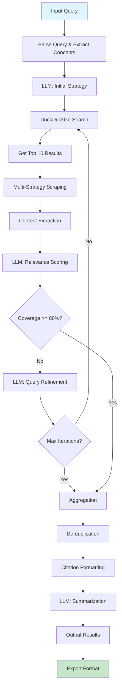

# Specifiche delle Funzionalità Principali

SearchMuse è costruito attorno a sei funzionalità core che lavorano insieme in un flusso integrato. Questa sezione descrive ciascuna in dettaglio.

---

## Feature 1: Ricerca Iterativa Intelligente

### Descrizione
Anziché effettuare una singola query di ricerca, SearchMuse raffina progressivamente la query in base ai risultati precedenti, migliorando rilevanza e copertura a ogni passo.

### Specifiche Funzionali

**Input Primario**:
- Query iniziale (testo naturale)
- Numero massimo di iterazioni (default: 3, range: 1-7)
- Strategia di ricerca (fast, balanced, comprehensive)

**Processo**:
1. Parse della query iniziale per concetti chiave
2. Estrazione di sottoargomenti e aspetti secondari
3. Per ogni iterazione:
   - Esecuzione ricerca con query attuale
   - Scraping dei top-10 risultati
   - Valutazione di rilevanza e copertura
   - Generazione di query raffinata (se convergenza non raggiunta)

**Output**:
- Set di risultati aggregati e de-duplicati
- Metadata su ogni iterazione (query, risultati trovati, score di rilevanza)
- Suggestion per ulteriori ricerche correlate

**Metriche**:
- Relevance Score: 0-100 (determinato da LLM)
- Coverage Score: 0-100 (percentuale di aspetti coperti)
- Iteration Count: numero reale di iterazioni eseguite
- Total Time: tempo da start a finish

### Esempio

```json
{
  "query": "best Python web frameworks 2026",
  "max_iterations": 3,
  "strategy": "comprehensive",
  "iterations": [
    {
      "iteration": 1,
      "query_used": "best Python web frameworks 2026",
      "results_found": 12,
      "relevance_score": 72,
      "coverage_score": 45
    },
    {
      "iteration": 2,
      "query_used": "Django FastAPI comparison 2026 performance",
      "results_found": 10,
      "relevance_score": 85,
      "coverage_score": 68
    },
    {
      "iteration": 3,
      "query_used": "FastAPI adoption enterprise 2026 production",
      "results_found": 8,
      "relevance_score": 88,
      "coverage_score": 82
    }
  ]
}
```

---

## Feature 2: Citazione Automatica delle Fonti

### Descrizione
Ogni informazione nei risultati è tracciabile fino alla fonte originale con URL preciso, timestamp, e contesto di estrazione.

### Specifiche Funzionali

**Metadati Catturati**:
- URL completo (canon)
- Titolo della pagina
- Author (se disponibile)
- Data di pubblicazione originale
- Data di accesso (quando scraping eseguito)
- Estratto contestuale (50-200 parole)
- Score di affidabilità della fonte

**Formati Supportati**:
- Markdown (default)
- HTML
- APA (American Psychological Association)
- MLA (Modern Language Association)
- Chicago Manual of Style
- Plain Text

**Processo di Estrazione**:
1. Identify contenuto principale della pagina
2. Extract metadati da `<head>` (Open Graph, Dublin Core, ecc.)
3. Localize estratti contestuali per ogni fatto citato
4. Validate URL per assicurare accessibilità
5. Format secondo schema richiesto

### Esempio (Markdown)

```markdown
[Best Python Web Frameworks 2026](https://example.com/frameworks)
- Source: example.com
- Accessed: 2026-02-28
- Context: "FastAPI has gained significant adoption in enterprise
  environments due to its async support and high performance..."
```

### Esempio (APA)

```
Example, J. (2026). Best python web frameworks 2026.
Retrieved from https://example.com/frameworks
```

---

## Feature 3: Estrazione Intelligente del Contenuto

### Descrizione
Estrae il contenuto principale da pagine web anche quando strutturate in modo complesso, navigando intorno a pubblicità, popup e contenuto irrilevante.

### Specifiche Funzionali

**Strategie di Estrazione**:
- Readability Algorithm (trafilatura library)
- Structured Data Extraction (JSON-LD, microdata)
- Heuristic Selection (area content detection)
- Element-based Extraction (CSS selectors custom)

**Filtri Applicati**:
- Rimozione di script e stylesheet
- Eliminazione di navigazione e sidebar
- Filtering di ads e tracking pixels
- Cleaning di whitespace e formattazione
- Preservation di link contestuali

**Output Generato**:
- Testo pulito (plaintext)
- Testo strutturato (markdown-like)
- Metadata di estrazione (confidence score, metodo)

### Qualità di Estrazione

| Tipo di Sito | Success Rate | Time per Page |
|-------------|-------------|--------------|
| News / Blog | 95%+ | 0.5-1.0s |
| Documentation | 98%+ | 0.3-0.7s |
| Forum | 85%+ | 0.7-1.2s |
| E-commerce | 70%+ | 1.0-2.0s |
| PDF-heavy | 60%+ | 1.5-3.0s |

---

## Feature 4: Integrazione Modelli LLM Locali

### Descrizione
Utilizza Ollama per eseguire modelli linguistici sulla macchina dell'utente, enabling intelligent query refinement e content analysis senza data exfiltration.

### Specifiche Funzionali

**Modelli Supportati**:
- Mistral 7B (default, veloce, buona qualità)
- Llama2 7B/13B (popolare, ben testato)
- Llama3 8B/70B (latest, best quality)
- Phi3 (micro, leggero, edge devices)
- Neural Chat (customizzato per dialog)

**Operazioni LLM Eseguite**:

1. **Query Refinement**:
   - Input: Query corrente, risultati precedenti, coverage gaps
   - Output: Query raffinata per prossima iterazione
   - Context window: 1000 tokens

2. **Relevance Scoring**:
   - Input: Contenuto estratto, query originale
   - Output: Score 0-100 di rilevanza
   - Context window: 500 tokens

3. **Content Summarization**:
   - Input: Testo estratto (fino a 2000 tokens)
   - Output: Sommario conciso 50-150 parole
   - Context window: 2500 tokens

4. **Aspect Identification**:
   - Input: Query, risultati aggregati
   - Output: Lista di aspetti principali identificati
   - Context window: 800 tokens

**Parametri Modello**:
```yaml
temperature: 0.3           # Bassa variabilità, risposte consistent
top_p: 0.9                # Nucleus sampling
top_k: 40                 # Top-k filtering
max_tokens: 500           # Limita output length
repeat_penalty: 1.1       # Evita ripetizioni
```

---

## Feature 5: Scraping Multi-Strategia

### Descrizione
Applica diverse strategie di scraping adattate ai pattern specifici di diversi siti web, maximizing success rate e minimizing false negatives.

### Specifiche Funzionali

**Strategie Disponibili**:

1. **HTML Parser** (90% dei siti)
   - BeautifulSoup4 parsing
   - CSS selectors
   - Metadata extraction

2. **JavaScript Rendering** (per SPAs)
   - Selenium / Playwright
   - Wait per dynamic content
   - Timer-based page loads

3. **API Direct** (quando disponibile)
   - Discovery di API endpoints
   - HTTP request diretti
   - JSON parsing

4. **Wayback Machine Fallback**
   - Se sito non disponibile
   - Retrieve archived versions
   - Timestamp specifico

**Conformità**:
- Respect robots.txt
- User-Agent identification
- Rate limiting (2 req/sec max)
- No password-protected content

**Timeout e Retry**:
```
Initial timeout: 5 seconds
Retry count: 2
Backoff: exponential (5s, 10s)
Circuit breaker: 3 failures = blacklist 5min
```

---

## Feature 6: Sintesi Intelligente dei Risultati

### Descrizione
Aggrega risultati da multiple iterazioni, elimina duplicati, e presenta un sommario strutturato con sezioni organizzate tematicamente.

### Specifiche Funzionali

**Fase di Aggregazione**:
- De-duplication per URL
- Consolidamento di contenuto simile
- Ranking per relevance e recency
- Outlier detection e rimozione

**Fasi di Sintesi**:
1. Aspect Extraction: Identifica 5-7 aspetti principali
2. Content Organization: Raggruppa risultati per tema
3. Narrative Generation: Crea sommario coerente
4. Citation Integration: Inserisce fonti contestualmente

**Formati di Output**:

a) **Markdown Strutturato** (default)
```
# Sommario: [Query]

## Aspetto 1: [Nome]
[Contenuto sintetizzato con inline citations]

## Aspetto 2: [Nome]
[Contenuto...]

## Fonti Citate
1. [Title](URL) - Accessed [Date]
2. [Title](URL) - Accessed [Date]
```

b) **JSON Strutturato**
```json
{
  "query": "...",
  "summary": "...",
  "aspects": [
    {
      "name": "...",
      "description": "...",
      "sources": [...]
    }
  ],
  "metadata": {
    "total_sources": 15,
    "coverage_score": 82,
    "iterations": 3,
    "total_time": 187
  }
}
```

c) **Plain Text** (esportazione semplice)

**Metriche di Qualità**:
- Completezza: % di aspetti coperti
- Coerenza: score di flow narrativo
- Verificabilità: % di affermazioni citate
- Concisione: rapporto info/parole

---

## Diagramma del Flusso di Ricerca



---

## Integrazione Feature nel Flusso

Le sei feature lavorano insieme in questo ordine:

```
1. RICERCA ITERATIVA (Feature 1)
   ├─ Inizia con query
   ├─ Effettua ricerca
   └─ Raffina iterativamente

2. SCRAPING MULTI-STRATEGIA (Feature 5)
   ├─ Scarica pagine
   ├─ Tenta multiple strategie
   └─ Estrae contenuto

3. ESTRAZIONE CONTENUTO (Feature 3)
   ├─ Pulisce HTML
   ├─ Estrae testo rilevante
   └─ Preserva metadati

4. INTEGRAZIONE LLM (Feature 4)
   ├─ Score rilevanza
   ├─ Raffina query
   └─ Sintetizza

5. CITAZIONE FONTI (Feature 2)
   ├─ Cattura metadati
   ├─ Valida URL
   └─ Formatta citazioni

6. SINTESI RISULTATI (Feature 6)
   ├─ Aggrega risultati
   ├─ Organizza tematicamente
   └─ Genera output finale
```

---

**Versione**: 1.0
**Ultimo aggiornamento**: 2026-02-28
