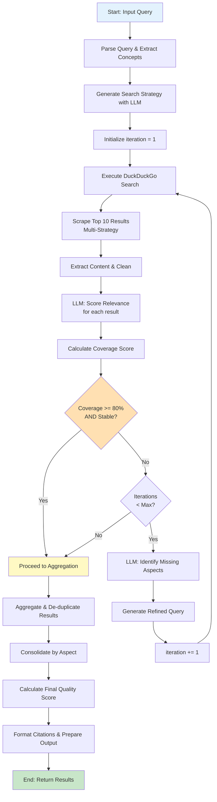

# Algoritmo di Raffinamento della Ricerca

## Panoramica

L'algoritmo di raffinamento è il cuore di SearchMuse. Migliora progressivamente la qualità dei risultati attraverso cicli iterativi di ricerca, valutazione e refinement. Ogni ciclo aumenta sia la **rilevanza** (quanto i risultati corrispondono alla query originale) che la **copertura** (quanti aspetti diversi dell'argomento sono rappresentati).

---

## Passi Algoritmo Dettagliato

### Passo 1: Parsing della Query Iniziale

La query in linguaggio naturale è processata per estrarre:

**Concetti Principali**: Parole chiave significative della query
```
Input:  "best Python web frameworks 2026"
Output: ["Python", "web frameworks", "2026", "best"]
```

**Modificatori di Contesto**: Temporal, spatial, qualitative
```
Temporal: 2026 (recency)
Qualitative: "best" (quality/comparison)
Domain: web frameworks (vertical)
```

**Intenzione della Query**: Cosa l'utente realmente cerca
```
Intentions: [
  "comparison among frameworks",
  "performance rankings",
  "adoption trends",
  "suitability for different use cases"
]
```

### Passo 2: Strategia Iniziale LLM

Un modello LLM genera una strategia di ricerca basata sulla query:

**Prompt Template**:
```
Given the query: "[QUERY]"
With concepts: [CONCEPTS]
And intentions: [INTENTIONS]

Generate a search strategy with:
1. Primary search terms (3-5)
2. Secondary search angles (2-3)
3. Aspects to explore (4-6)
4. Quality filters to apply
5. Expected result types

Format as JSON.
```

**Output Strategico Tipico**:
```json
{
  "primary_terms": [
    "Python web frameworks 2026",
    "Django FastAPI comparison",
    "best Python backend framework"
  ],
  "secondary_angles": [
    "framework adoption statistics 2026",
    "web framework performance benchmark"
  ],
  "aspects": [
    "performance metrics",
    "community size and activity",
    "learning curve",
    "scalability",
    "deployment options",
    "recent innovations"
  ],
  "quality_filters": ["recent", "authoritative", "detailed"],
  "expected_types": ["blog posts", "benchmarks", "official docs"]
}
```

### Passo 3: Esecuzione Ricerca DuckDuckGo

Esecuzione della ricerca utilizzando il termine primario:

**Parametri Ricerca**:
```
query: "[SEARCH TERM]"
results: 10
time_range: "recent (if temporal modifier present)"
safe_search: true
```

**Deduplicazione Risultati**:
- Rimozione URL duplicate
- Filtering di short URLs e redirects
- Prioritizzazione di domini autorevoli

**Risultato**: Lista di 10 risultati con URL, titolo, snippet

### Passo 4: Scraping Multi-Strategia

Per ogni risultato nei top 10:

```
For each URL in results:
  1. Try HTML parsing
  2. If fails, try JavaScript rendering
  3. If fails, try Wayback Machine
  4. Extract content and metadata
  5. Store raw content for analysis
```

**Success Rate Target**: ≥ 80% dei risultati processati

### Passo 5: Estrazione e Cleaning Contenuto

Per ogni pagina scaricata con successo:

```
1. Remove scripts, styles, ads
2. Extract main content using trafilatura
3. Clean whitespace and normalize text
4. Extract metadata (author, date, title)
5. Identify and preserve key sections
6. Store extraction confidence score
```

**Output**: Contenuto pulito + metadati

### Passo 6: Valutazione della Rilevanza

LLM valuta ogni risultato rispetto alla query originale:

**Prompt**:
```
Query: [ORIGINAL_QUERY]
Content: [EXTRACTED_CONTENT - first 1000 tokens]
Aspects sought: [ASPECT_LIST]

Score this content on relevance 0-100:
- Does it address the main query? (0-30 points)
- Does it cover important aspects? (0-40 points)
- Is information recent and authoritative? (0-30 points)

Provide score and brief reasoning.
```

**Output**:
```json
{
  "relevance_score": 82,
  "relevance_reasoning": "Addresses 4/6 aspects, recent, good authority",
  "aspects_covered": ["performance", "community", "scalability"],
  "missing_aspects": ["deployment", "learning curve"]
}
```

**Score Interpretation**:
- 0-40: Irrelevant or tangential
- 40-60: Somewhat relevant, missing key aspects
- 60-80: Good relevance, most aspects covered
- 80-100: Highly relevant, comprehensive

### Passo 7: Valutazione della Copertura

Aggregando i relevance scores, calcola **Coverage Score**:

**Formula**:
```
coverage_score = (
  (aspects_covered_count / total_aspects_count) * 50 +
  (avg_relevance_score / 100) * 50
)
```

**Esempio**:
```
Total aspects: 6
Aspects covered: 4 (67%)
Average relevance: 78

coverage_score = (4/6 * 50) + (78/100 * 50)
               = 33.3 + 39
               = 72.3
```

### Passo 8: Decisione Raffinamento o Convergenza

**Se coverage_score >= 80**:
- Ricerca ha raggiunto qualità target
- Procedi a aggregazione finale
- Convergenza raggiunta

**Se coverage_score < 80 AND iterations < max_iterations**:
- Identifica aspetti mancanti
- Genera query raffinata
- Continua prossima iterazione

**Se iterations >= max_iterations**:
- Termina anche se coverage < 80
- Ritorna risultati attuali

### Passo 9: Generazione Query Raffinata

**Prompt LLM**:
```
Original Query: [QUERY]
Original Aspects: [ORIGINAL_ASPECTS]
Aspects Covered So Far: [COVERED_ASPECTS]
Aspects Still Missing: [MISSING_ASPECTS]
Previous Queries Used: [PREVIOUS_QUERIES]

Generate a NEW search query that will find content
addressing the missing aspects, without duplicating
previous queries. Make it natural language, not keyword spam.

Return ONLY the query string.
```

**Esempio di Raffinamento**:
```
Iteration 1 Query: "best Python web frameworks 2026"
Covered: performance, community, popularity
Missing: deployment, enterprise adoption, learning curve

Iteration 2 Query (Generated):
"Python web framework deployment enterprise adoption 2026"

Iteration 3 Query (Generated):
"learning FastAPI Django curve beginners comparison"
```

---

## Criteri di Convergenza

La ricerca converge quando **tutte** queste condizioni sono vere:

1. **Coverage >= 80%**: Almeno 80% degli aspetti principali coperti
2. **Relevance >= 75%**: Media relevance score >= 75
3. **Stabilità**: Due iterazioni consecutive producono coverage simile (<5% differenza)
4. **Tempo ragionevole**: < 3 minuti totali di ricerca
5. **Diversità Fonti**: >= 5 domini differenti rappresentati

Se non raggiunta con max_iterations, termina e ritorna best result ottenuto.

---

## Formula del Quality Score

Metrica composita che combina multiple dimensioni:

```
quality_score = (
  coverage_score         * 0.35 +
  avg_relevance_score    * 0.25 +
  source_diversity_score * 0.15 +
  recency_score          * 0.15 +
  authority_score        * 0.10
)
```

### Componenti

**Coverage Score** (0-100):
- Percentuale di aspetti identificati e coperti
- Più aspetti = risultati più completi

**Relevance Score** (0-100):
- Media dei relevance score dei top risultati
- Determinato da LLM

**Source Diversity Score** (0-100):
- Numero di domini distinti / benchmark
- Penalizza ripetizioni da stesso dominio

**Recency Score** (0-100):
- Basato su data di pubblicazione risultati
- 2026 = 100, 2025 = 85, 2024 = 70, pre-2024 = 50

**Authority Score** (0-100):
- Valutazione di affidabilità del dominio
- .edu/.gov = 90+, noto media = 75-85, unknown = 50

### Interpretazione Quality Score Finale

- 0-50: Qualità bassa, risultati incompleti o non rilevanti
- 50-70: Qualità media, risultati accettabili ma gaps presenti
- 70-85: Buona qualità, risultati soddisfacenti per uso generale
- 85-95: Alta qualità, risultati completi e affidabili
- 95-100: Qualità eccellente, copertura esaustiva

---

## Diagramma di Flusso Algoritmo



---

## Ejemplo de Ejecución Completa

### Query Inicial
```
"best Python web frameworks 2026"
```

### Iteración 1
```
Search Term: "best Python web frameworks 2026"
Results Found: 12
Coverage Score: 72% (missing: deployment, learning curve)
Relevant Results: 8/10
Decision: Refine and continue
```

### Iteración 2
```
Search Term: "Python Django FastAPI Flask deployment 2026"
Results Found: 10
New Coverage: 85% (now includes deployment)
Relevant Results: 9/10
Decision: Converged - stop
```

### Final Quality Score
```
Coverage: 85 * 0.35 = 29.75
Relevance: 82 * 0.25 = 20.5
Diversity: 88 * 0.15 = 13.2
Recency: 90 * 0.15 = 13.5
Authority: 80 * 0.10 = 8.0

Total: 85.0 / 100 (Alta Qualità)
```

---

## Ottimizzazioni e Euristiche

**Early Termination**: Se dopo 1 iterazione coverage > 90%, termina
**Caching**: Cache risultati per query identiche per 24 ore
**Rate Limiting**: Max 2 richieste/secondo per rispettare robots.txt
**Timeout**: Max 30 secondi per singolo URL
**Circuit Breaker**: Se dominio fallisce 3 volte, blacklist per 5 minuti

---

**Versione**: 1.0
**Ultimo aggiornamento**: 2026-02-28
