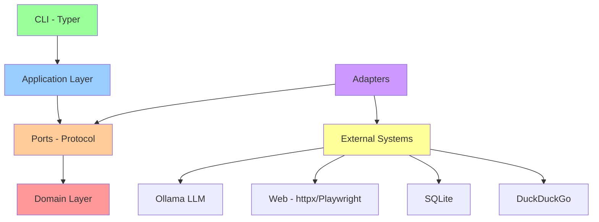

# Architettura

SearchMuse implementa l'architettura esagonale (nota anche come Clean Architecture o Ports & Adapters) per garantire una separazione chiara delle responsabilità e una facilità di estensione e testing.

## Panoramica dell'Architettura Esagonale

L'architettura esagonale divide il sistema in strati concentrici, dove le dipendenze puntano sempre verso il centro (verso il dominio). Questo approccio garantisce che il codice di dominio rimane completamente indipendente dai dettagli di implementazione.

### Diagramma dell'Architettura



## Strati dell'Architettura

### 1. Domain Layer (Centro)

Contiene la logica di business pura e i modelli di dominio. Questo strato è completamente indipendente da qualsiasi framework o libreria esterna.

**Responsabilità:**
- Definire le entità di dominio (SearchQuery, SearchResult, Citation, ecc.)
- Implementare la logica di business core
- Definire gli invarianti di dominio
- Gestire lo stato del dominio

**Caratteristiche:**
- Zero dipendenze esterne
- Completamente testabile in isolamento
- Usa dataclass congelate per l'immutabilità
- Eccezioni di dominio specifiche

### 2. Ports Layer

Definisce le interfacce attraverso cui il dominio comunica con il mondo esterno. I port sono espressi come Python Protocol per massima flessibilità.

**Responsabilità:**
- Definire contratti di comportamento
- Specificare input/output attesi
- Separare la definizione dall'implementazione

**Port Principali:**
- `LLMPort`: Interfaccia per i modelli linguistici
- `WebScraperPort`: Interfaccia per il web scraping
- `SearchEnginePort`: Interfaccia per i motori di ricerca
- `RepositoryPort`: Interfaccia per la persistenza

### 3. Adapters Layer

Implementa i port con connessioni concrete a sistemi esterni. Ogni adapter adatta un sistema esterno al contratto definito dal port.

**Adapter Principali:**
- `OllamaLLMAdapter`: Comunica con Ollama
- `PlaywrightScraper`: Web scraping con Playwright
- `DuckDuckGoSearch`: Integrazione con DuckDuckGo
- `SQLiteRepository`: Persistenza su SQLite

**Responsabilità:**
- Tradurre dati da/verso sistemi esterni
- Gestire dettagli di connessione e configurazione
- Implementare retry logic e error handling specifici
- Non contenere logica di business

### 4. Application Layer

Orchestrazione della logica di use case. Coordina il dominio e i port per implementare i flussi di lavoro dell'applicazione.

**Responsabilità:**
- Implementare use case specifici
- Coordinare il flusso dei dati
- Gestire le transazioni
- Mappare eccezioni di dominio in risposte applicative

### 5. CLI Layer

Interfaccia a riga di comando basata su Typer. Comunica con l'application layer e presenta i risultati all'utente.

**Responsabilità:**
- Parsing degli argomenti CLI
- Presentazione dei risultati
- Gestione dell'I/O dell'utente
- Formattazione dell'output

## Architecture Decision Records (ADR)

### ADR-001: Architettura Esagonale

**Decisione**: Implementare l'architettura esagonale invece di un'architettura a strati tradizionale.

**Motivazione**:
- Separazione chiara tra logica di business e dettagli tecnici
- Testing facilitato grazie all'isolamento del dominio
- Facilità di cambio dei componenti esterni (DB, LLM, web scraper)
- Allineamento con principi di Clean Code e Clean Architecture

**Compromessi**:
- Più file rispetto a un'architettura semplice
- Curva di apprendimento per nuovi contributori
- Overhead di coordinazione tra strati

**Revisione**: Aprile 2026

### ADR-002: Dataclass Congelate per l'Immutabilità

**Decisione**: Usare `@dataclass(frozen=True)` per tutte le entità di dominio.

**Motivazione**:
- Previene mutazioni accidentali dello stato
- Abilita il caching (objects congelati sono hashable)
- Facilita il ragionamento sulla correttezza
- Supporta la programmazione funzionale

**Implementazione**:
```python
from dataclasses import dataclass

@dataclass(frozen=True)
class SearchQuery:
    query: str
    max_iterations: int = 3
    language: str = "it"
```

**Trade-off**: Richiede di ritornare nuove istanze per ogni modifica.

### ADR-003: Protocol invece di ABC per i Port

**Decisione**: Usare Python Protocol per i port invece di Abstract Base Classes.

**Motivazione**:
- Structural subtyping: supporta il duck typing
- Nessuna ereditarietà richiesta
- Migliore compatibilità con type checking
- Più flessibile per mock e test

**Implementazione**:
```python
from typing import Protocol

class LLMPort(Protocol):
    def generate(self, prompt: str) -> str: ...
    def summarize(self, text: str) -> str: ...
```

**Vantaggio**: Adapter possono implementare il port senza ereditarietà esplicita.

## Regola delle Dipendenze

### Il Principio Fondamentale

Le dipendenze devono sempre puntare verso l'interno:

```
Esterno → Adapter → Port → Dominio
```

Non è mai permesso il contrario:

```
Dominio → Port (OK)
Port → Dominio (OK)
Adapter → Dominio (OK)
Dominio → Adapter (VIETATO)
```

### Validazione delle Dipendenze

```python
# CORRETTO: Dominio riceve adapter tramite port
class SearchService:
    def __init__(self, llm: LLMPort, search: SearchEnginePort):
        self.llm = llm
        self.search = search

# SBAGLIATO: Dominio importa direttamente adapter
from adapters.ollama import OllamaLLMAdapter
# NON FARE QUESTO!
```

## Flusso di Comunicazione

```
User Input
    ↓
CLI Layer (Typer)
    ↓
Application Layer (Use Case)
    ↓
Domain Layer (Business Logic)
    ↓
Ports (Interfaces)
    ↓
Adapters (Implementations)
    ↓
External Systems (Ollama, Web, DB)
```

## Benefici di questa Architettura

1. **Testabilità**: Il dominio è testabile senza dipendenze esterne
2. **Manutenibilità**: Cambiamenti in componenti esterni non impattano il dominio
3. **Estensibilità**: Nuovi adapter possono essere aggiunti senza modificare il dominio
4. **Chiarezza**: La struttura è evidente dalla cartelle e dalle import
5. **Indipendenza da Framework**: Il dominio non dipende da framework specifici

## Struttura delle Cartelle

```
searchmuse/
├── domain/              # Logica di business pura
│   ├── models.py       # Entità di dominio
│   ├── services.py     # Logica di business
│   └── exceptions.py    # Eccezioni di dominio
├── ports/              # Interfacce (Protocol)
│   ├── llm_port.py
│   ├── search_port.py
│   └── repository_port.py
├── adapters/           # Implementazioni concrete
│   ├── ollama/
│   ├── playwright/
│   └── sqlite/
├── application/        # Orchestrazione
│   └── use_cases.py
└── cli/               # Interfaccia utente
    └── commands.py
```

---

**Versione**: 1.0
**Ultimo Aggiornamento**: Febbraio 2026
**Stato**: Stabile
