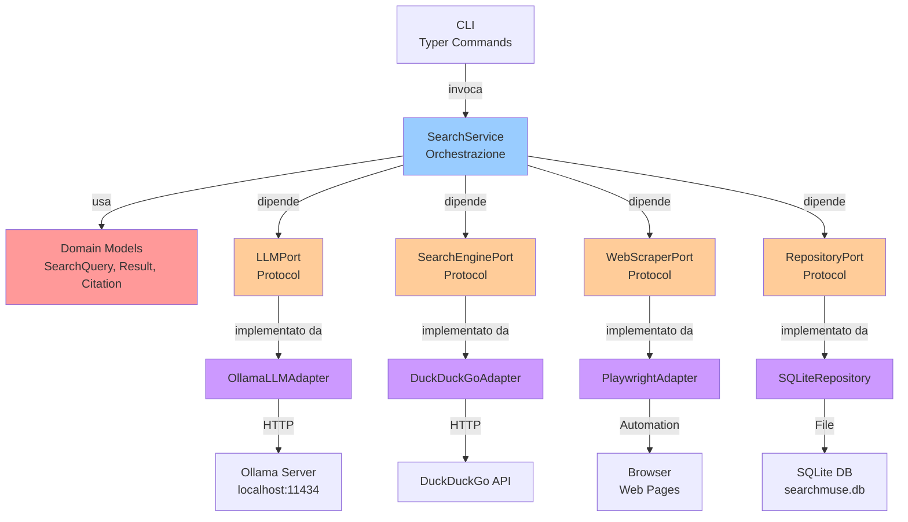

# Componenti

Questo documento descrive i componenti principali di SearchMuse, le loro responsabilità, le interfacce e le interazioni.

## Modelli di Dominio

### SearchQuery

Rappresenta una query di ricerca fornita dall'utente.

```python
@dataclass(frozen=True)
class SearchQuery:
    query: str
    max_iterations: int
    language: str
    metadata: dict[str, Any]
```

**Responsabilità**: Encapsulare i parametri della ricerca iniziale.

### SearchResult

Rappresenta un risultato di ricerca da una fonte esterna.

```python
@dataclass(frozen=True)
class SearchResult:
    title: str
    url: str
    snippet: str
    source: str
    retrieved_at: datetime
```

**Responsabilità**: Mantenere un singolo risultato recuperato da una ricerca.

### Citation

Rappresenta una citazione con metadata completo.

```python
@dataclass(frozen=True)
class Citation:
    source_url: str
    source_title: str
    excerpt: str
    page_number: int | None
    retrieved_at: datetime
```

**Responsabilità**: Tracciare le fonti utilizzate per le risposte.

### IterationResult

Rappresenta il risultato di una singola iterazione di ricerca.

```python
@dataclass(frozen=True)
class IterationResult:
    iteration_number: int
    refined_query: str
    search_results: list[SearchResult]
    llm_analysis: str
    citations_used: list[Citation]
```

**Responsabilità**: Aggregare i risultati di ogni iterazione.

### ResearchSession

Rappresenta una sessione di ricerca completa.

```python
@dataclass(frozen=True)
class ResearchSession:
    session_id: str
    initial_query: SearchQuery
    iterations: list[IterationResult]
    final_answer: str
    total_sources: int
    created_at: datetime
    completed_at: datetime | None
```

**Responsabilità**: Aggregare tutti i dati di una sessione di ricerca.

## Interfacce (Ports)

### LLMPort

Interfaccia per i modelli linguistici.

```python
class LLMPort(Protocol):
    def generate(self, prompt: str) -> str:
        """Genera testo basato sul prompt fornito."""
        ...

    def summarize(self, text: str, max_length: int) -> str:
        """Riassume un testo."""
        ...

    def refine_query(self, current_query: str, context: str) -> str:
        """Affina una query di ricerca basata sul contesto."""
        ...
```

**Implementazioni Pianificate**:
- `OllamaLLMAdapter`: Comunica con Ollama
- `OpenAILLMAdapter`: Supporto OpenAI (futuro)

### SearchEnginePort

Interfaccia per i motori di ricerca.

```python
class SearchEnginePort(Protocol):
    def search(self, query: str, num_results: int) -> list[SearchResult]:
        """Esegue una ricerca e ritorna i risultati."""
        ...

    def search_with_filters(
        self,
        query: str,
        num_results: int,
        language: str,
        safe_search: bool
    ) -> list[SearchResult]:
        """Esegue una ricerca con filtri."""
        ...
```

**Implementazioni Pianificate**:
- `DuckDuckGoAdapter`: DuckDuckGo search API
- `GoogleAdapter`: Google Custom Search (futuro)

### WebScraperPort

Interfaccia per il web scraping.

```python
class WebScraperPort(Protocol):
    def fetch(self, url: str, timeout: int) -> str:
        """Recupera il contenuto HTML di una URL."""
        ...

    def extract_text(self, html: str) -> str:
        """Estrae testo pulito da HTML."""
        ...
```

**Implementazioni Pianificate**:
- `PlaywrightAdapter`: Web scraping con Playwright
- `HttpxAdapter`: Fetch semplice con httpx

### RepositoryPort

Interfaccia per la persistenza.

```python
class RepositoryPort(Protocol):
    def save_session(self, session: ResearchSession) -> str:
        """Salva una sessione di ricerca."""
        ...

    def get_session(self, session_id: str) -> ResearchSession | None:
        """Recupera una sessione di ricerca."""
        ...

    def list_sessions(self, limit: int) -> list[ResearchSession]:
        """Elenca le sessioni recenti."""
        ...
```

**Implementazioni Pianificate**:
- `SQLiteRepository`: SQLite database
- `PostgresRepository`: PostgreSQL (futuro)

## Adapter (Implementazioni)

### OllamaLLMAdapter

Comunica con il server Ollama locale.

**Responsabilità**:
- Mantiene la connessione con Ollama
- Formatta i prompt secondo lo stile di Ollama
- Gestisce timeout e retry
- Parsea le risposte

**Configurazione Richiesta**:
```yaml
ollama:
  host: localhost
  port: 11434
  model: mistral
  timeout: 30
```

### DuckDuckGoAdapter

Integrazione con DuckDuckGo Search API.

**Responsabilità**:
- Costruisce query per DuckDuckGo
- Parsea i risultati della ricerca
- Gestisce rate limiting
- Gestisce errori di connessione

### PlaywrightAdapter

Web scraping con Playwright.

**Responsabilità**:
- Lancia il browser
- Naviga verso le URL
- Estrae il contenuto
- Gestisce JavaScript rendering

**Configurazione Richiesta**:
```yaml
playwright:
  headless: true
  timeout: 10000
  disable_images: true
```

### SQLiteRepository

Persistenza su SQLite.

**Responsabilità**:
- Crea schema del database
- Salva sessioni di ricerca
- Recupera sessioni storiche
- Gestisce transazioni
- Pulisce i dati obsoleti

## Service Layer (Application)

### SearchService

Orches tra il processo di ricerca iterativa.

```python
class SearchService:
    def __init__(
        self,
        llm: LLMPort,
        search_engine: SearchEnginePort,
        scraper: WebScraperPort,
        repository: RepositoryPort
    ):
        ...

    def research(
        self,
        query: SearchQuery
    ) -> ResearchSession:
        """Esegue una ricerca iterativa completa."""
        ...
```

**Flusso**:
1. Ottiene i risultati iniziali della ricerca
2. Itera N volte (configurabile)
3. Per ogni iterazione:
   - Analizza i risultati con LLM
   - Affina la query se necessario
   - Recupera nuovi risultati
   - Estrae citations
4. Ritorna ResearchSession con risposta finale

## Diagramma di Interazione dei Componenti



## Flusso di Dati tra Componenti

### Ricerca Iniziale

```
User Query
    ↓
CLI.search_command()
    ↓
SearchService.research()
    ↓
SearchEnginePort.search()
    ↓
DuckDuckGoAdapter
    ↓
SearchResult list
```

### Analisi e Raffinamento

```
SearchResult list
    ↓
LLMPort.refine_query()
    ↓
OllamaLLMAdapter
    ↓
Refined Query string
    ↓
SearchEnginePort.search()
    ↓
Nuovi SearchResult
```

### Salvataggio dei Risultati

```
ResearchSession
    ↓
RepositoryPort.save_session()
    ↓
SQLiteRepository
    ↓
SQLite Database
```

## Estensibilità e Nuovi Componenti

Per aggiungere un nuovo componente:

1. **Definire il Port** in `ports/`
2. **Implementare l'Adapter** in `adapters/`
3. **Aggiornare SearchService** per usare il nuovo port
4. **Scrivere i test** per il nuovo adapter

Esempio per un nuovo LLM provider:

```python
# In ports/llm_port.py (aggiungere al Protocol esistente)

# In adapters/claude/claude_adapter.py
class ClaudeLLMAdapter:
    def generate(self, prompt: str) -> str:
        # Implementazione specifica per Claude
        pass
```

---

**Versione**: 1.0
**Ultimo Aggiornamento**: Febbraio 2026
**Stato**: Stabile
