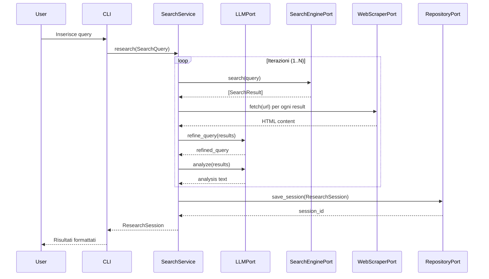
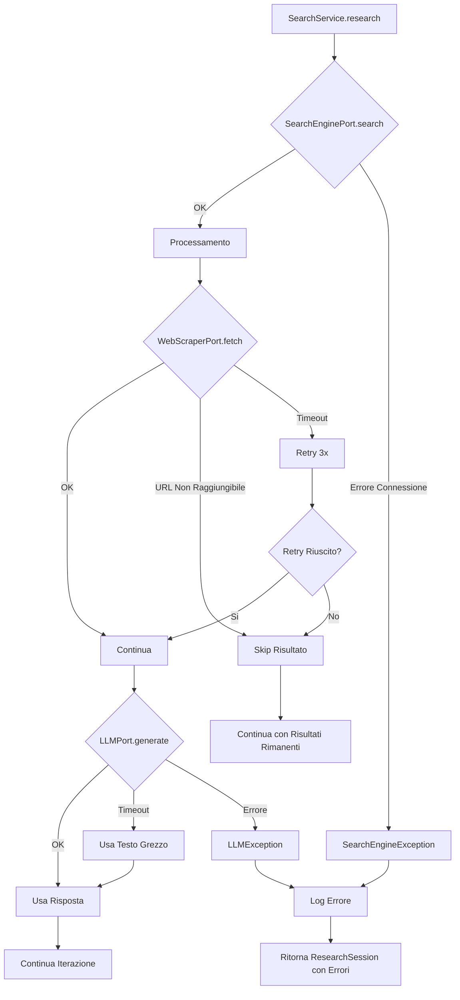

# Flusso dei Dati

Questo documento descrive come i dati fluiscono attraverso SearchMuse durante una sessione di ricerca.

## Panoramica del Flusso Generale



## Flusso Dettagliato per Iterazione

### Fase 1: Ricerca Iniziale

```
1. User fornisce query iniziale
2. CLI crea SearchQuery object:
   {
     query: "Come funziona la fotosintesi?",
     max_iterations: 3,
     language: "it",
     metadata: {}
   }
3. SearchService.research() viene chiamato
4. Richiama SearchEnginePort.search(query)
5. DuckDuckGoAdapter esegue la ricerca HTTP
6. Riceve JSON di risultati
7. Parsea in list[SearchResult]:
   [
     {
       title: "Fotosintesi - Wikipedia",
       url: "https://it.wikipedia.org/wiki/Fotosintesi",
       snippet: "La fotosintesi è un processo biologico...",
       source: "duckduckgo",
       retrieved_at: 2026-02-28T10:30:00Z
     },
     ...
   ]
```

### Fase 2: Scraping e Estrazione Contenuto

```
Per ogni SearchResult (limitato a top 5):

1. SearchService richiama WebScraperPort.fetch(url)
2. PlaywrightAdapter:
   - Lancia il browser
   - Naviga a URL
   - Attende caricamento pagina
   - Estrae il testo pulito
   - Ritorna HTML/testo

3. SearchService ritiene importante il contenuto
4. Crea o aggiorna Citation object:
   {
     source_url: "https://it.wikipedia.org/wiki/Fotosintesi",
     source_title: "Fotosintesi - Wikipedia",
     excerpt: "La fotosintesi è un processo biologico che converte...",
     page_number: null,
     retrieved_at: 2026-02-28T10:30:00Z
   }
```

### Fase 3: Analisi con LLM

```
1. SearchService prepara il prompt per LLM:

   PromptTemplate.ANALYSIS = """
   Basandoti su questi risultati di ricerca:
   {results}

   Analizza e estrai le informazioni chiave relative alla query:
   "{query}"

   Sii conciso e accurato.
   """

2. SearchService richiama LLMPort.summarize(content)
3. OllamaLLMAdapter:
   - Formatta il prompt
   - Invia a Ollama HTTP API (localhost:11434)
   - Riceve testo generato
   - Ritorna il riassunto

4. IterationResult viene aggiornato:
   {
     iteration_number: 1,
     refined_query: null,  # ancora non raffinato
     search_results: [...],
     llm_analysis: "La fotosintesi è il processo...",
     citations_used: [...]
   }
```

### Fase 4: Raffinamento Query

```
Se iteration < max_iterations:

1. SearchService prepara raffinamento:
   PromptTemplate.REFINE = """
   Query originale: "{original_query}"

   Analisi dei risultati finora: {analysis}

   Suggerisci una query di ricerca più specifica che
   potrebbe portare a risultati più mirati.

   Ritorna solo la query raffinata.
   """

2. Richiama LLMPort.refine_query(original_query, analysis)
3. OllamaLLMAdapter genera query raffinata
4. Ritorna: "Processo di fotosintesi nelle piante C3 vs C4"
5. SearchService usa questa nuova query per prossima iterazione
6. Torna a Fase 1 con query raffinata
```

## Trasformazioni Dati per Iterazione

### Iterazione 1 (Ricerca Iniziale)

```
Input: SearchQuery
  query: "Come funziona la fotosintesi?"

Processamento:
  - Ricerca con query originale
  - Scraping primi 5 risultati
  - Analisi LLM dei contenuti

Output: IterationResult
  iteration_number: 1
  refined_query: "Fotosintesi processi chimici luce cloroplasti"
  search_results: [SearchResult, ...]  # 5 risultati
  llm_analysis: "La fotosintesi è..."
  citations_used: [Citation, ...]  # 3-5 citations
```

### Iterazione 2 (Query Raffinata)

```
Input: Previous IterationResult
  refined_query: "Fotosintesi processi chimici luce cloroplasti"

Processamento:
  - Ricerca con query raffinata
  - Scraping primi 5 risultati (nuovi e precedenti)
  - Analisi LLM focalizzata su aspetti chimici
  - Combinazione insights da iterazione 1 e 2

Output: IterationResult
  iteration_number: 2
  refined_query: "Reazioni dipendenti dalla luce fase scura Calvin"
  search_results: [SearchResult, ...]  # 5 nuovi/aggiornati
  llm_analysis: "Il ciclo di Calvin è..."
  citations_used: [Citation, ...]  # 4-6 citations
```

### Iterazione 3 (Approfondimento)

```
Input: Previous IterationResult
  refined_query: "Reazioni dipendenti dalla luce fase scura Calvin"

Processamento:
  - Ricerca sulla fase scura e ciclo di Calvin
  - Scraping e analisi ulteriore
  - Consolidamento di tutti gli insights

Output: IterationResult
  iteration_number: 3
  refined_query: null  # Ultima iterazione
  search_results: [SearchResult, ...]
  llm_analysis: "Il ciclo di Calvin è il processo della fase scura..."
  citations_used: [Citation, ...]  # 5-7 citations
```

## Aggregazione Risultati Finali

```
1. SearchService consolida tutte le IterationResult:

ResearchSession {
  session_id: "research_2026-02-28_10-30-abc123",
  initial_query: SearchQuery{...},
  iterations: [
    IterationResult{iteration_number: 1, ...},
    IterationResult{iteration_number: 2, ...},
    IterationResult{iteration_number: 3, ...}
  ],
  final_answer: """
    La fotosintesi è il processo biologico mediante il quale
    le piante convertono la luce solare in energia chimica...
    [Riassunto consolidato da tutte le iterazioni]
  """,
  total_sources: 15,
  created_at: 2026-02-28T10:30:00Z,
  completed_at: 2026-02-28T10:45:00Z
}

2. SearchService salva la sessione:
   RepositoryPort.save_session(research_session)

3. SQLiteRepository:
   - Serializza ResearchSession in JSON
   - Salva in database con metadata
   - Indicizza per ricerca veloce
```

## Flusso di Gestione Errori



## Trasformazione Dati Attraverso gli Strati

### Layer Traversal - Una Query

```
1. CLI Layer
   Input: "Come funziona la fotosintesi?"
   ↓
   searchmuse --query "Come funziona la fotosintesi?"

2. Application Layer
   Input: str
   ↓
   SearchQuery(query="Come funziona...", max_iterations=3)

3. Domain Layer
   Input: SearchQuery
   ↓
   Validazione: query non vuota, max_iterations > 0
   ↓
   Creazione modelli di dominio

4. Ports Layer
   Input: Comandi di dominio
   ↓
   SearchEnginePort.search(query: str) -> list[SearchResult]
   LLMPort.analyze(text: str) -> str

5. Adapters Layer
   Input: Comandi del port
   ↓
   DuckDuckGoAdapter: HTTP GET /search?q=...
   OllamaAdapter: HTTP POST /api/generate

6. External Systems
   Input: HTTP requests
   ↓
   DuckDuckGo API, Ollama Server, Browser
   ↓
   Output: JSON, testo HTML, generazioni LLM

7. Return Path (Aggregazione)
   Raw Data → Structured (SearchResult, Citation)
   → Domain Models → ResearchSession
   → JSON serialization → Database storage
   → CLI output → User display
```

## Performance e Caching

### Caching Risultati di Ricerca

```
Se query="Come funziona la fotosintesi?" è stata ricercata:

1. Ricerca iniziale -> risultati cache con TTL 24h
2. Successive ricerche con stessa query:
   - Usa risultati cache (< 10ms)
   - Non fa HTTP request a DuckDuckGo
   - Mantiene list[SearchResult] in SQLite con timestamp

3. Cache invalidation:
   - Scadenza temporale (24 ore default)
   - Invalidazione esplicita da CLI
   - Update di configurazione search
```

### Riduzione Carico LLM

```
Per ricerche simili:

Iterazione 1: "Come funziona la fotosintesi?"
  → LLM genera analisi completa

Iterazione 2: "Quali sono i tipi di fotosintesi?"
  → Usa cache results da iterazione 1
  → Ricicla parte dell'analisi precedente
  → LLM genera solo supplement analisi
```

---

**Versione**: 1.0
**Ultimo Aggiornamento**: Febbraio 2026
**Stato**: Stabile
