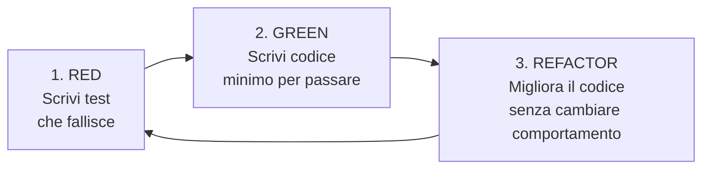

# Strategia di Test

SearchMuse usa Test-Driven Development (TDD) per assicurare qualità del codice, mantenibilità e fiducia nei refactoring.

## Principi TDD

L'approccio TDD segue il ciclo Red-Green-Refactor:



### Red Phase (Rosso)

1. Scrivi un test che descrive la nuova funzionalità
2. Esegui il test - deve fallire
3. Questo assicura che il test è significativo

### Green Phase (Verde)

1. Scrivi il codice minimo necessario per passare il test
2. Esegui il test - deve passare
3. Non scrivere codice non necessario

### Refactor Phase (Refactor)

1. Migliora il codice senza cambiare il comportamento
2. Esegui i test per verificare
3. I test proteggono contro regressioni

## Struttura dei Test

### Organizzazione dei File

```
tests/
├── unit/                      # Test unitari (veloci, isolati)
│   ├── domain/
│   │   ├── test_models.py
│   │   ├── test_services.py
│   │   └── test_exceptions.py
│   ├── adapters/
│   │   ├── test_ollama_adapter.py
│   │   ├── test_duckduckgo_adapter.py
│   │   └── test_sqlite_repository.py
│   └── application/
│       └── test_use_cases.py
├── integration/               # Test integrazione (più lenti, real deps)
│   ├── test_search_workflow.py
│   ├── test_llm_integration.py
│   └── test_database_persistence.py
├── e2e/                       # Test end-to-end (più lenti, full system)
│   ├── test_cli_search.py
│   └── test_full_research_flow.py
├── fixtures/                  # Dati di test condivisi
│   ├── mock_data.py
│   └── factories.py
└── conftest.py               # Configurazione pytest globale
```

### Convenzioni di Naming

```python
# Test file
test_<module_name>.py

# Test class
class Test<ClassName>:
    pass

# Test function
def test_<what_is_being_tested>_<expected_outcome>():
    pass

# Esempi
def test_search_query_with_empty_query_raises_value_error():
    pass

def test_search_service_performs_multiple_iterations():
    pass

def test_llm_adapter_timeout_raises_exception():
    pass
```

## Tipi di Test

### 1. Test Unitari

Testano singole funzioni o metodi in isolamento.

**Caratteristiche**:
- Veloci (< 100ms per test)
- Isolati (nessuna dipendenza esterna)
- Deterministici (stesso risultato ogni volta)
- Focalizzati (testano una sola cosa)

**Esempio**:

```python
import pytest
from searchmuse.domain.models import SearchQuery

class TestSearchQuery:
    def test_create_query_with_valid_input(self):
        query = SearchQuery(query="Test query")
        assert query.query == "Test query"
        assert query.max_iterations == 3

    def test_create_query_with_empty_query_raises_error(self):
        with pytest.raises(ValueError):
            SearchQuery(query="")

    def test_query_is_immutable(self):
        query = SearchQuery(query="Test")
        with pytest.raises(AttributeError):
            query.query = "Modified"
```

### 2. Test di Integrazione

Testano come diversi componenti interagiscono.

**Caratteristiche**:
- Più lenti (0.1-5 secondi per test)
- Usano dipendenze reali o simulate
- Testano workflow multi-componente
- Verificano contratti tra componenti

**Esempio**:

```python
import pytest
from unittest.mock import AsyncMock
from searchmuse.adapters.sqlite import SQLiteRepository
from searchmuse.domain.models import ResearchSession

@pytest.fixture
def temp_db():
    """Crea un database temporaneo per il test."""
    import tempfile
    with tempfile.NamedTemporaryFile(suffix=".db") as f:
        yield f.name

def test_repository_save_and_retrieve_session(temp_db):
    """Verifica che una sessione salvata può essere recuperata."""
    repo = SQLiteRepository(database_path=temp_db)
    session = create_test_session()

    session_id = repo.save_session(session)
    retrieved = repo.get_session(session_id)

    assert retrieved is not None
    assert retrieved.initial_query.query == session.initial_query.query
    assert len(retrieved.iterations) == len(session.iterations)
```

### 3. Test End-to-End (E2E)

Testano l'intero flusso di applicazione.

**Caratteristiche**:
- Molto lenti (5-60 secondi per test)
- Testano tutti i layer
- Useranno sistemi reali quando possibile
- Testano l'esperienza dell'utente finale

**Esempio**:

```python
import pytest
from typer.testing import CliRunner
from searchmuse.cli.main import app

@pytest.fixture
def cli_runner():
    return CliRunner()

def test_cli_search_command_returns_results(cli_runner):
    """Testa il comando search da riga di comando."""
    result = cli_runner.invoke(
        app,
        ["search", "--query", "Python", "--max-iterations", "1"]
    )

    assert result.exit_code == 0
    assert "Python" in result.stdout
    assert "session_id:" in result.stdout
```

## Fixtures e Setup/Teardown

### pytest Fixtures

Le fixtures forniscono dati e risorse ai test.

```python
import pytest
from searchmuse.domain.models import SearchQuery, SearchResult, Citation

@pytest.fixture
def sample_query():
    """Fornisce una SearchQuery di test."""
    return SearchQuery(query="Test query")

@pytest.fixture
def sample_search_results():
    """Fornisce SearchResult di test."""
    return [
        SearchResult(
            title="Result 1",
            url="https://example.com/1",
            snippet="This is a snippet",
            source="test",
            retrieved_at=datetime.now()
        ),
        SearchResult(
            title="Result 2",
            url="https://example.com/2",
            snippet="Another snippet",
            source="test",
            retrieved_at=datetime.now()
        )
    ]

@pytest.fixture
def mock_llm_port(mocker):
    """Fornisce un mock dell'LLMPort."""
    mock = mocker.MagicMock()
    mock.generate.return_value = "Generated text"
    mock.summarize.return_value = "Summarized text"
    mock.refine_query.return_value = "Refined query"
    return mock

# Uso nei test
def test_search_service_with_fixtures(sample_query, sample_search_results, mock_llm_port):
    # Usa le fixtures...
    pass
```

### Scoped Fixtures

```python
# Function scope (default) - crea nuovo per ogni test
@pytest.fixture(scope="function")
def temp_file():
    pass

# Class scope - condiviso per tutti i test in una classe
@pytest.fixture(scope="class")
def database():
    pass

# Module scope - condiviso per tutti i test nel modulo
@pytest.fixture(scope="module")
def config():
    pass

# Session scope - condiviso per tutti i test nella sessione
@pytest.fixture(scope="session")
def ollama_server():
    pass
```

## Mocking e Stubbing

### Mock di Dipendenze Esterne

```python
from unittest.mock import Mock, patch, AsyncMock

def test_search_service_calls_llm_port(mocker):
    """Testa che SearchService chiama l'LLMPort."""
    # Mock delle dipendenze
    mock_search = mocker.MagicMock()
    mock_llm = mocker.MagicMock()
    mock_scraper = mocker.MagicMock()
    mock_repo = mocker.MagicMock()

    mock_search.search.return_value = [create_test_search_result()]
    mock_llm.analyze.return_value = "Analysis text"
    mock_llm.refine_query.return_value = "Refined query"

    # Crea il servizio con mock
    service = SearchService(
        llm=mock_llm,
        search_engine=mock_search,
        scraper=mock_scraper,
        repository=mock_repo
    )

    # Esegui il test
    session = service.research(create_test_query())

    # Verifica le chiamate
    mock_search.search.assert_called()
    mock_llm.analyze.assert_called()
    assert session is not None
```

### Parametrized Tests

Testa la stessa logica con dati diversi.

```python
import pytest

@pytest.mark.parametrize("query,expected_iterations", [
    ("Simple query", 3),
    ("Complex query with details", 3),
    ("", ValueError),  # Caso di errore
])
def test_search_query_validation(query, expected_iterations):
    """Testa la creazione di SearchQuery con diversi input."""
    if expected_iterations == ValueError:
        with pytest.raises(ValueError):
            SearchQuery(query=query)
    else:
        q = SearchQuery(query=query, max_iterations=expected_iterations)
        assert q.query == query
        assert q.max_iterations == expected_iterations
```

## Target di Coverage

SearchMuse mira a mantenere almeno **80% di code coverage**.

```bash
# Eseguire con coverage report
pytest tests/ --cov=searchmuse --cov-report=html --cov-report=term-missing

# Mostra percentuale di coverage per file
pytest tests/ --cov=searchmuse --cov-report=term-missing
```

### Target per Area

- **Domain models**: 95%+ (core della business logic)
- **Services/Use cases**: 90%+ (orchestrazione)
- **Adapters**: 85%+ (integrazioni esterne)
- **CLI**: 70%+ (harder to test, user-facing)

## Strategie di Test

### Test di Dominio

Testano la logica di business pura senza dipendenze esterne.

```python
def test_research_session_aggregates_iterations():
    """Testa che ResearchSession aggreghi correttamente le iterazioni."""
    iterations = [
        create_test_iteration(number=1),
        create_test_iteration(number=2),
    ]
    session = ResearchSession(
        session_id="test-123",
        initial_query=create_test_query(),
        iterations=iterations,
        final_answer="Final answer",
        total_sources=5,
        created_at=datetime.now()
    )

    assert len(session.iterations) == 2
    assert session.is_complete() is False  # completed_at is None
```

### Test di Adapter

Testano che gli adapter traducono correttamente tra dominio e sistemi esterni.

```python
def test_duckduckgo_adapter_parses_results(mocker):
    """Testa che l'adapter DuckDuckGo parsea correttamente i risultati."""
    mock_response = {
        "results": [
            {
                "title": "Test Result",
                "link": "https://example.com",
                "snippet": "Test snippet"
            }
        ]
    }

    adapter = DuckDuckGoAdapter()
    mocker.patch.object(
        adapter,
        "_make_request",
        return_value=mock_response
    )

    results = adapter.search("test query")

    assert len(results) == 1
    assert results[0].title == "Test Result"
    assert isinstance(results[0], SearchResult)
```

### Test di Use Case

Testano l'orchestrazione tra componenti.

```python
def test_research_use_case_completes_all_iterations(mocker):
    """Testa che il use case esegua tutte le iterazioni."""
    mock_search = mocker.MagicMock()
    mock_llm = mocker.MagicMock()
    mock_search.search.return_value = [create_test_search_result()]
    mock_llm.refine_query.return_value = "refined"
    mock_llm.analyze.return_value = "analysis"

    use_case = ResearchUseCase(
        search_engine=mock_search,
        llm=mock_llm
    )

    query = SearchQuery(query="test", max_iterations=3)
    session = use_case.execute(query)

    # Deve aver fatto 3 iterazioni
    assert len(session.iterations) == 3
```

## Running Tests

### Eseguire Tutti i Test

```bash
pytest tests/
```

### Eseguire Categorie Specifiche

```bash
# Solo unit test
pytest tests/unit/

# Solo integration test
pytest tests/integration/

# Solo E2E
pytest tests/e2e/

# Escludi E2E (per development veloce)
pytest tests/ -m "not e2e"
```

### Opzioni Utili

```bash
# Verbose output
pytest tests/ -v

# Mostra i print statements
pytest tests/ -s

# Esegui un test specifico
pytest tests/unit/test_models.py::TestSearchQuery::test_create_query_with_valid_input

# Esegui in parallelo (veloce!)
pytest tests/ -n auto

# Ferma al primo fallimento
pytest tests/ -x

# Mostra coverage
pytest tests/ --cov=searchmuse --cov-report=html
```

## Checklist prima del Commit

Prima di fare commit, assicurati che:

- [ ] Tutti i test passano: `pytest tests/ -v`
- [ ] Coverage >= 80%: `pytest tests/ --cov=searchmuse`
- [ ] Nessun warning: `pytest tests/ -W error`
- [ ] Codice formattato: `black searchmuse tests/`
- [ ] Linting ok: `ruff check searchmuse tests/`
- [ ] Type checking ok: `mypy searchmuse`

---

**Versione**: 1.0
**Ultimo Aggiornamento**: Febbraio 2026
**Stato**: Stabile
